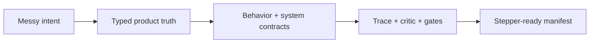
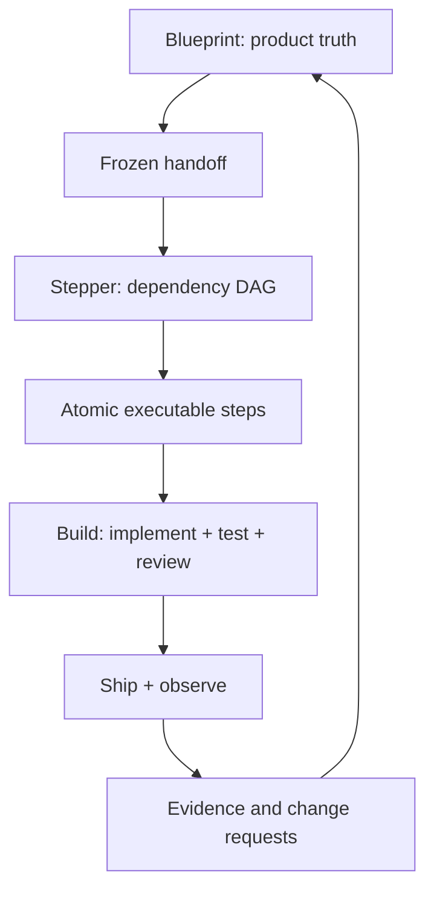

# Blueprint {OS} — Deep Professional Guide

## Contents

1. What Blueprint {OS} really is
2. Why ordinary product documents fail
3. The three-layer truth model
4. How the compiler thinks
5. Why traceability is the backbone
6. The place of UX, architecture, AI, and safety
7. The orchestration model
8. Quality and completion
9. Relationship with Stepper and Build
10. How Blueprint evolves with the product

## 1. What Blueprint {OS} really is

Blueprint {OS} is not a long prompt that writes a PRD. It is the **definition layer of an autonomous software company**.

A normal document describes an idea. Blueprint creates a controlled truth system that can answer:

- What are we building and why?
- For whom, in what context, and against which alternative?
- What can every actor do?
- Under which permissions, preconditions, limits, and failure conditions?
- What changes in the domain and data when an action occurs?
- Which screen, API, event, AI tool, metric, test, and risk corresponds to that action?
- Which claims came from the user, which were evidenced, and which are still assumptions?
- What changed between versions and what else must change because of it?
- Is the definition strong enough for an implementation planner to proceed without guessing?

Its deliverable is both human-readable documentation and machine-addressable canonical state.

## 2. Why ordinary product documents fail

Traditional PRDs often fail in predictable ways:

1. They list features without defining behavior.
2. They focus on happy paths and ignore failure/recovery.
3. UX, business rules, data, architecture, and testing live in separate documents and drift.
4. Decisions are mixed with assumptions, so nobody knows what is authoritative.
5. Requirements have no stable IDs and cannot be traced.
6. AI is described as “smart” without context, permissions, memory, evals, or fallback.
7. The roadmap begins before the product is coherent.
8. A document is declared done because it is long, not because it is complete.

Blueprint solves these by behaving like a compiler:

The key difference is validation. A prose generator asks, “Did I write enough?” A compiler asks, “Does every important intent resolve into coherent, verifiable downstream contracts?”

## 3. The three-layer truth model

Blueprint has three simultaneous representations.

### 3.1 Epistemic truth

This answers: **How do we know this?**

- Facts are evidenced.
- Decisions are authoritative choices.
- Assumptions allow progress but remain provisional.
- Proposals await acceptance.
- Unknowns remain visible.
- Conflicts force resolution.

Without this layer, an AI can confidently turn its own idea into a fake user requirement.

### 3.2 Product truth

This answers: **What must the product mean and do?**

It includes actors, value, capabilities, actions, flows, permissions, states, rules, screens, metrics, and acceptance.

### 3.3 System truth

This answers: **What system contracts are necessary to uphold product truth?**

It includes domain models, data ownership, APIs, events, architecture, AI boundaries, security, reliability, and operations.

Traceability joins the layers:

`Evidence/Decision → Requirement → Behavior → System Contract → Test → Metric/Risk`

## 4. How the compiler thinks

Blueprint moves through controlled passes.

### Recover before proposing

If a project already exists, the first job is not creativity. It is recovering the latest accepted truth. This prevents an agent from undoing weeks of decisions because it saw only one recent message.

### Normalize vocabulary

Product inconsistency often begins with language. If “member,” “customer,” “subscriber,” and “user” are used interchangeably, permissions, billing, analytics, and schemas will diverge. Blueprint establishes ubiquitous language early.

### Model value before scope

The engine identifies the transformation and value event before deciding capabilities. This keeps feature volume from becoming the strategy.

### Model actions before screens

A screen is a presentation of actions and information. Defining screens first produces beautiful but logically weak products. Blueprint defines the actor, intent, permission, rule, state mutation, event, failure, and receipt; then it designs the interface that makes that behavior usable.

### Model domain before infrastructure

Architecture must uphold the domain. Starting with a fashionable stack tends to push product rules into accidental database or UI behavior. Blueprint first defines ownership, state, invariants, consistency, and failure semantics.

### Verify before handoff

A requirement that cannot be verified is still ambiguous. Acceptance design is part of product definition, not something added by QA later.

## 5. Why traceability is the backbone

Traceability makes Blueprint operational.

Suppose pricing decision `DEC-014` changes. The trace graph can reveal:

- capabilities and entitlements affected;
- requirements that embody the old rule;
- onboarding/paywall/settings screens displaying it;
- billing entities and invariants;
- checkout and webhook APIs/events;
- analytics definitions and revenue forecasts;
- acceptance tests;
- migration and customer-communication risks.

Without traceability, the change becomes a search-and-hope exercise. With traceability, Omega OS can perform an impact analysis, create a new version, and send Stepper only the affected delta.

Traceability also prevents two kinds of waste:

- **orphan intent**: accepted ideas that never become behavior;
- **orphan implementation**: screens, services, fields, or events that satisfy no accepted need.

The 95% normative coverage target is a safety threshold, not a vanity score. Critical decisions and requirements remain at 100%.

## 6. The place of UX, architecture, AI, and safety

### UX is a behavioral contract

Blueprint treats loading, empty, error, offline, denied, expired, stale, duplicate, and partial-success states as first-class. A user flow is incomplete until the user can recover or understand what happened.

The screen contract becomes the bridge between design and engineering. It prevents vague prompts such as “make a premium dashboard” from hiding data, permission, or error-state ambiguity.

### Architecture is a consequence system

Blueprint architecture exists to preserve product invariants under real constraints. It chooses boundaries based on ownership, data consistency, failure isolation, latency, team capability, cost, and evolution.

An Architecture Decision Record is not simply “use Convex” or “use PostgreSQL.” It states why, alternatives, consequences, risks, reversibility, and how fitness will be validated.

### AI is a bounded operational capability

An AI feature is not complete until Blueprint defines:

- what the model may and may not decide;
- what context it sees and where that data came from;
- what it remembers and how memory is corrected/deleted;
- which tools it can call;
- when it must ask for confirmation;
- how it abstains;
- how it is evaluated before and after launch;
- what happens when models/providers fail;
- how cost and latency are controlled;
- how users see provenance, traces, receipts, and undo.

This converts “agentic” from a marketing word into an engineering and trust contract.

### Safety is part of the product, not an appendix

Permissions, consent, abuse, fraud, privacy, incident response, moderation, and appeals influence core flows and data. Blueprint models them before code so Build does not discover trust boundaries too late.

## 7. The orchestration model

Blueprint can run with one model, but the professional form uses specialist passes over a shared state.

The important idea is not the number of agents. It is the **shared canonical state and controlled merge**.

Each specialist receives:

- a frozen baseline revision;
- an explicit read set;
- a bounded write set;
- required output schema;
- authority limits.

Specialists return patches, trace links, findings, and questions. The Chief Blueprint Editor reconciles them against decisions and evidence. It does not merge contradictory prose blindly.

Parallelism is useful for independent analysis, but dangerous without:

- optimistic concurrency;
- stable IDs;
- conflict records;
- a single merge authority;
- impact analysis;
- final gate evaluation.

This is why a multi-agent Blueprint resembles a compiler pipeline and database transaction system more than a group chat.

## 8. Quality and completion

Blueprint uses gates because completeness is multidimensional.

A project may have excellent UX and fail because data ownership is undefined. It may have clean architecture and fail because incentives are unsafe. It may have a full feature list and fail because no one defined acceptance.

The gates cover:

- evidence;
- strategy/value;
- capabilities/requirements;
- permissions/consent;
- actions/flows/interfaces;
- domain integrity;
- architecture/data/contracts;
- AI safety/evaluation;
- security/privacy/abuse;
- non-functional/operations;
- acceptance;
- metrics;
- traceability;
- change impact;
- release definition;
- artifact continuity.

`BLUEPRINT COMPLETE — STEPPER READY` is a semantic status. It is impossible while a critical conflict, missing permission, unverified critical requirement, incomplete AI safety contract, or missing handoff remains.

Length has no role in completion. A concise coherent Blueprint can pass; a 500-page contradictory one cannot.

## 9. Relationship with Stepper and Build

Blueprint answers:

- what must be true;
- why it matters;
- how actors experience it;
- what rules/contracts/tests define correctness.

Stepper answers:

- in what order to build;
- which dependencies and vertical slices;
- what prompt/context/reference each step needs;
- what commands/tests/gates prove each step;
- how progress and retries are tracked.

Build answers:

- how to implement inside the actual repository;
- how to test, review, diagnose, fix, integrate, and deploy.

Keeping these layers separate prevents planning from silently rewriting product truth and prevents coding momentum from hardening unexamined assumptions.

## 10. How Blueprint evolves with the product

Blueprint is not discarded after development starts. It becomes a versioned product contract.

Operational evidence may reveal:

- an assumption was false;
- users follow a different flow;
- an AI evaluation regressed;
- an integration has unacceptable failure modes;
- a metric creates harmful incentives;
- a business rule needs revision;
- a new jurisdiction changes data obligations.

The correct loop is:

1. register evidence;
2. revise/supersede the affected decision or assumption;
3. perform trace-based impact analysis;
4. update affected contracts and acceptance;
5. re-run gates;
6. create a new frozen handoff/delta;
7. let Stepper plan the change and Build implement it.

Blueprint {OS} therefore becomes the source of product memory, not a one-time planning artifact. It preserves the reasoning behind the software and makes autonomous development governable.
