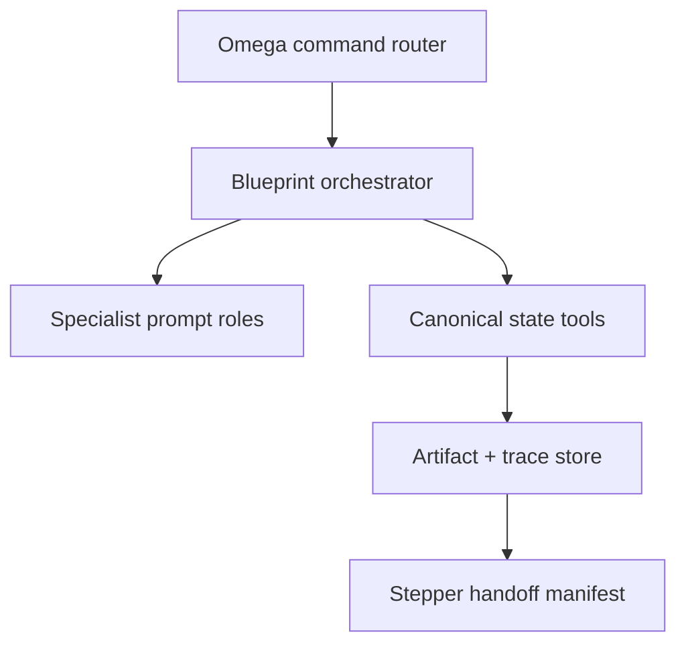

# Omega OS Integration

## Contents

1. Installation model
2. Required runtime components
3. Command routing
4. Agent graph
5. Persistence
6. Tool registration
7. Prompt assembly
8. Stepper handoff
9. Verification
10. Deployment profiles

## 1. Installation model

Install Blueprint {OS} as a bounded compiler service within Omega OS, not as one oversized chat prompt. Use four layers:



1. **System layer** — master prompt and hard boundary.
2. **Skill layer** — procedural workflow and conditional references.
3. **Function layer** — deterministic state, IDs, traceability, gates, checkpoints, exports.
4. **Persistence layer** — versioned project state and rendered artifacts.

The included manifest is [../assets/omega-os.manifest.json](../assets/omega-os.manifest.json).

Use the safe installer in dry-run mode first:

```bash
python3 scripts/install_omega_os.py /absolute/path/to/omega-os
python3 scripts/install_omega_os.py /absolute/path/to/omega-os --apply
```

It preserves existing differing files unless `--force` is explicitly provided after reviewing the exact dry-run targets.

## 2. Required runtime components

Omega OS needs:

- a command router supporting `/blueprint` and aliases;
- a prompt assembler with system/developer/task/source separation;
- an orchestrator supporting sequential passes and optional fan-out/fan-in;
- a project-scoped state store;
- typed function/tool dispatch;
- source retrieval adapters;
- an artifact renderer/exporter;
- revision/checkpoint support;
- a Stepper handoff interface;
- observability for runs, tools, models, cost, latency, failures, and gates.

Recommended logical paths:

```text
omega-os/
  skills/blueprint-os/SKILL.md
  prompts/blueprint-os/system.md
  prompts/blueprint-os/roles/*.md
  tools/blueprint-os/definitions.json
  schemas/blueprint-os/state.schema.json
  config/blueprint-os.manifest.json
  state/projects/<project-id>/blueprint/
  artifacts/projects/<project-id>/blueprint/
```

Adapt paths to Omega OS conventions. Do not duplicate canonical state in multiple writable stores.

## 3. Command routing

Register:

| Command | Mode | Behavior |
| --- | --- | --- |
| `/blueprint <idea>` | infer/NEW | full compiler run |
| `/blueprint recover <project>` | RECOVER | restore canonical baseline |
| `/blueprint extend <module>` | EXTEND | add capability with impact audit |
| `/blueprint revise <decision>` | REVISE | supersede and propagate |
| `/blueprint audit` | AUDIT | gates/orphans/conflicts only plus remediation |
| `/blueprint delta <a> <b>` | DELTA | semantic difference and impact |
| `/blueprint continue` | current | resume continuation pointer |
| `/blueprint status` | current | status, blockers, progress, gates |
| `/blueprint export <view>` | current | render a view from canonical state |

Routing invariants:

- namespace state by project;
- load latest accepted state before interpreting an elliptical command;
- bind `/stepper` to Stepper {OS}, never Blueprint;
- bind `/build` to Build {OS}, never Blueprint;
- refuse `/stepper` handoff when Blueprint eligibility gates fail unless the user explicitly asks for a provisional planning exercise clearly labeled non-authoritative.

## 4. Agent graph

Use a graph only when the runtime supports shared-state merge and revision control. Otherwise execute the same roles sequentially.

Recommended node contract:

```json
{
  "node_id": "model_domain",
  "run_id": "...",
  "baseline_revision": 12,
  "read_sets": ["requirements", "actions", "flows"],
  "write_sets": ["entities", "rules", "invariants", "state_machines"],
  "output_mode": "patch",
  "must_emit": ["records", "trace_links", "findings", "questions"],
  "may_accept_decisions": false
}
```

Chief Editor merge contract:

- validate baseline revision;
- schema-check output;
- reject writes outside node write set;
- convert proposed records to canonical typed records;
- allocate stable IDs centrally;
- detect same-record conflicts;
- merge non-conflicting patches;
- register conflicts instead of choosing silently;
- run impact and trace updates;
- commit one new revision.

## 5. Persistence

Minimum persistence layout per project:

```text
blueprint/
  state.json
  journal.ndjson
  checkpoints/
  sources.json
  exports/
  handoffs/
```

Production implementation may use PostgreSQL/document storage/graph projections/object storage. Preserve these semantics:

- authoritative current state;
- append-only history;
- immutable source fingerprints;
- stable IDs;
- typed trace graph;
- checkpoint/recovery;
- semantic versions;
- confidential-data labels;
- artifact-to-state revision link.

## 6. Tool registration

Load [../assets/blueprint-tools.json](../assets/blueprint-tools.json) into Omega's function registry and implement handlers against the canonical store.

Recommended handler interface:

```ts
type BlueprintToolContext = {
  actorId: string;
  projectId: string;
  runId: string;
  permissions: string[];
  traceId: string;
};

type BlueprintToolResult<T> = {
  ok: boolean;
  revision: number;
  data?: T;
  findings?: BlueprintFinding[];
  error?: { code: string; message: string; retryable: boolean };
};
```

Implement idempotency, optimistic concurrency, audit records, input limits, and typed errors. Do not allow general filesystem or database access through model-controlled arguments.

## 7. Prompt assembly

Assemble context in this order:

1. Omega platform safety/system policy;
2. Blueprint master system prompt;
3. project/user authority and current request;
4. skill workflow relevant to the current pass;
5. canonical state slice;
6. authorized source excerpts labeled as untrusted data;
7. node-specific task contract;
8. output schema and budget.

Do not concatenate all project files. Retrieve by artifact/read set, entity IDs, semantic search, and latest authority. Include source locators so every claim remains traceable.

Context-budget policy:

- always include hard boundaries, current decisions, constraints, non-goals, glossary, run status, and relevant IDs;
- include only records reachable from the current read set plus conflict/impact neighbors;
- summarize long historical versions but retain exact pointers;
- never truncate schemas, invariants, or permissions mid-record;
- checkpoint before context compaction.

## 8. Stepper handoff

Stepper consumes a frozen Blueprint version, never a moving latest pointer.

Handoff object:

```json
{
  "handoff_id": "BPH-...",
  "project_id": "...",
  "blueprint_version": "2.1.0",
  "state_revision": 184,
  "state_checksum": "sha256:...",
  "status": "BLUEPRINT COMPLETE — STEPPER READY",
  "release_groups": [],
  "capabilities": [],
  "requirements": [],
  "dependencies": [],
  "contracts": {
    "ux": [],
    "domain": [],
    "data": [],
    "api": [],
    "events": [],
    "ai": [],
    "security": [],
    "nfr": [],
    "operations": []
  },
  "acceptance": [],
  "risks": [],
  "mandatory_validation_spikes": [],
  "prohibited_shortcuts": [],
  "conditional_items": [],
  "artifact_refs": []
}
```

When Blueprint changes after handoff, create a new version and send a delta to Stepper. Never mutate a frozen handoff in place.

## 9. Verification

Before enabling production routing, verify:

1. `/blueprint` never calls Build tools.
2. `continue` restores exact next section and ID counters.
3. current explicit user decisions supersede older context with history retained.
4. unrelated projects do not leak state into each other.
5. duplicate tool calls remain idempotent.
6. stale parallel patches are rejected/reconciled.
7. trace auditor detects seeded orphans and contradictions.
8. gate evaluator refuses completion with one critical failure.
9. AI action without permission/eval/fallback fails G12.
10. confidential sources are excluded from unauthorized exports.
11. Stepper handoff freezes version/checksum.
12. a resumed run after compaction produces no ID collision.

Use `scripts/blueprint_os.py demo`, `init`, `validate`, and `status` for local contract verification.

## 10. Deployment profiles

### Minimal single-agent

- one master prompt;
- sequential passes;
- JSON state file;
- deterministic validation;
- Markdown export.

Use for solo projects and prototypes. Preserve all boundaries and IDs.

### Professional orchestrated

- shared project store;
- specialist DAG;
- merge/editor node;
- trace graph;
- checkpoint/recovery;
- versioned exports and handoffs;
- run observability.

Use as the default Omega OS target.

### Enterprise governed

Add:

- project/record-level access controls;
- policy-as-code checks;
- source confidentiality and retention;
- approval workflows for decisions/risk acceptance;
- evidence/audit exports;
- model/tool allowlists;
- evaluation regression suite;
- compliance and change-management integration.
