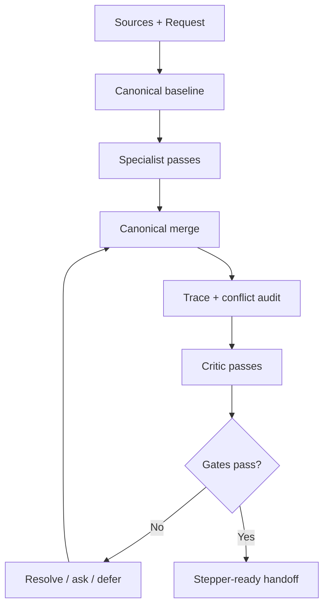

# Orchestration and Quality Gates

## Contents

1. Shared-state architecture
2. Logical roles
3. Execution graph
4. Merge and conflict protocol
5. Critic passes
6. Gate definitions
7. Readiness scoring

## 1. Shared-state architecture

Blueprint {OS} is a compiler pipeline over one canonical state, not a committee producing disconnected essays.



Required shared-state properties:

- project namespace and semantic version;
- stable ID allocator per prefix;
- append-preserving decision history;
- typed epistemic records;
- normalized artifact store;
- typed trace edges;
- validation findings with severity and disposition;
- optimistic revision/checksum for concurrent merges;
- continuation pointer and gate snapshot.

## 2. Logical roles

Roles may run sequentially in one model or in parallel agents. The artifacts—not free-form prose—are their interface.

| Role | Reads | Writes | Cannot decide alone |
| --- | --- | --- | --- |
| Context Librarian | all sources | source/evidence/decision baseline | new product choices |
| Product Strategist | baseline | thesis, positioning, goals, non-goals | architecture |
| JTBD Analyst | baseline, strategy | actors, JTBD, value journeys | pricing authority |
| Business Analyst | strategy, actors | value exchange, economics, incentives | user intent |
| Capability Architect | prior models | capabilities, requirements, dependencies | final acceptance |
| UX/IA Architect | requirements, actors | flows, IA, screens, design rules | business invariants |
| Domain Modeler | actions, rules | entities, states, policies, invariants | UX presentation |
| System Architect | NFRs, domain | architecture, ADRs, integrations | product scope |
| Data/API/Event Architect | domain, architecture | schemas and contracts | business policy |
| AI Architect | AI requirements, data | AI/context/memory/tools/evals | unsafe autonomy |
| Safety Analyst | all contracts | threats, abuse, privacy, mitigations | risk acceptance |
| Quality Engineer | requirements/contracts | acceptance and test model | redefine intent |
| Trace Auditor | all IDs/edges | coverage/orphan report | fabricate edges |
| Red-Team Critic | canonical draft | challenges/findings | silently mutate truth |
| Chief Editor | all artifacts | reconciled canonical pack | override explicit user decision |

## 3. Execution graph

Recommended DAG:

1. `frame_run`
2. `recover_sources`
3. `normalize_epistemics`
4. `freeze_baseline`
5. Parallel wave A:
   - `model_strategy`
   - `model_users_jtbd`
   - `model_business_economics`
6. `reconcile_product_truth`
7. Parallel wave B:
   - `model_capabilities_requirements`
   - `model_roles_permissions`
   - `model_metrics`
8. `reconcile_scope`
9. Parallel wave C:
   - `model_actions_flows`
   - `model_ux_ia_screens`
   - `model_domain_rules`
10. `reconcile_behavior`
11. Parallel wave D:
   - `model_architecture`
   - `model_data_api_events`
   - `model_ai_system`
   - `model_security_privacy_abuse`
   - `model_operations_nfrs`
12. `reconcile_system`
13. Parallel wave E:
   - `author_acceptance_tests`
   - `build_traceability`
   - `build_risk_register`
   - `define_release_boundaries`
14. `audit_orphans_conflicts`
15. `run_critics`
16. `resolve_findings`
17. `evaluate_gates`
18. `checkpoint_or_handoff`

### Baseline freeze

Each parallel wave receives a revision token. A specialist output must state:

- baseline revision read;
- artifacts read;
- new/changed records;
- assumptions introduced;
- conflicts found;
- trace edges proposed;
- confidence and open questions.

Reject stale merges touching the same normative record. Re-run or explicitly reconcile.

## 4. Merge and conflict protocol

Conflict resolution order:

1. current explicit instruction;
2. later accepted decision from authority;
3. hard safety/legal/platform constraint;
4. evidenced domain invariant;
5. product promise and accepted non-goal;
6. accepted architecture/business decision;
7. reversible assumption;
8. proposal.

For every conflict:

```yaml
id: CNF-001
claims: [DEC-003, DEC-019]
scope: "pricing entitlement"
severity: critical
authority_analysis: "..."
downstream_impact: [REQ-022, RULE-004, SCR-011, API-008]
resolution: "..."
status: resolved
resolved_by: DEC-024
```

Never resolve by deleting history. Mark supersession and propagate impact.

## 5. Critic passes

Run at least these lenses before final gates:

| Lens | Core question | Typical output |
| --- | --- | --- |
| Product | Is the job important and the promise coherent? | scope/value correction |
| Minimality | What can be removed without breaking value? | anti-feature or defer |
| UX | Can each actor complete and recover? | missing state/action |
| Domain | Are prohibited states and transitions explicit? | invariant/rule |
| Architecture | Do boundaries follow requirements and ownership? | ADR revision |
| Data | Can the system obtain, govern, reconcile, delete the data? | lifecycle rule |
| AI | Can the model fail safely and measurably? | confirmation/eval/fallback |
| Safety | How can actors abuse permissions or incentives? | mitigation/test |
| Reliability | What happens under partial external failure? | retry/compensation |
| Operations | Who performs non-automated work? | runbook/role/SLO |
| Economics | Are incentives and service costs sustainable? | metric/constraint |
| Traceability | Which intent or implementation object is orphaned? | missing edge/artifact |

Critic findings are immutable records with status and disposition. Do not bury rejected or deferred high-severity findings.

## 6. Gate definitions

Use `PASS`, `CONDITIONAL`, `FAIL`, or `N/A` plus evidence and blockers.

### G01 — Scope and identity

Pass when project boundary, mission, actors, stage, scope, non-goals, terminology, and Blueprint/Stepper/Build boundary are explicit.

### G02 — Evidence integrity

Pass when sources are inventoried, authoritative decisions are recovered, epistemic labels are correct, and no proposal is presented as fact.

### G03 — Strategy and value

Pass when target struggle, promised progress, value loop, differentiation, value exchange, principles, and metrics are coherent.

### G04 — Capability and requirement completeness

Pass when capabilities have actors/value/dependencies/rules/acceptance and requirements are atomic, normative, prioritized, and testable.

### G05 — Actor, permission, and consent

Pass when every consequential action has identity, authorization, ownership, consent/revocation, audit, and admin/service-account controls.

### G06 — Action and flow completeness

Pass when critical jobs have end-to-end happy, alternate, failure, recovery, cancellation/offboarding, and operator paths.

### G07 — Interface contract completeness

Pass when IA/navigation and all required screens/surfaces include data, actions, states, permissions, accessibility, responsive behavior, and telemetry.

### G08 — Domain integrity

Pass when entities, ownership, lifecycle, state machines, invariants, temporal/concurrency/idempotency/reversal rules prevent invalid states.

### G09 — Architecture coherence

Pass when system boundaries, responsibilities, integrations, failure domains, deployment, environments, and evolution satisfy requirements/NFRs.

### G10 — Data governance

Pass when source of truth, schema, tenancy, sensitivity, provenance, consistency, retention, export, deletion, encryption, and migrations are defined.

### G11 — API/event/integration contracts

Pass when public/internal contracts define schemas, auth, errors, versioning, delivery, retries, compatibility, abuse controls, and observability.

### G12 — AI-system safety and evaluability

Pass when every AI capability defines bounded responsibility, context/memory/tools, autonomy, confirmation, provenance, abstention, evals, fallback, monitoring, cost, and latency.

### G13 — Security/privacy/abuse

Pass when material threats and abuse cases have controls, response, appeals where applicable, and verification.

### G14 — NFR and operations

Pass when measurable SLOs/targets, observability, support, moderation/data/content operations, backup/restore, incident, and continuity needs are specified.

### G15 — Acceptance and testability

Pass when critical requirements and invariants have observable acceptance and the test architecture covers contracts, permissions, failure, recovery, migration, accessibility, and AI.

### G16 — Metrics and learning

Pass when value/activation/retention/economic/operational metrics are precisely defined and connected to events/actions, with guardrails and decision thresholds.

### G17 — Traceability

Pass when all critical decisions and requirements have complete backward/forward links, general normative coverage is at least 95%, and all orphans are reported.

### G18 — Conflict and change impact

Pass when no unresolved critical conflict exists and accepted changes have propagated across affected artifacts.

### G19 — Release-definition coherence

Pass when validation, foundations, first value slice, core, expansion, migration, rollout/rollback, and evidence gates are coherent without atomic implementation tasks.

### G20 — Artifact and continuation integrity

Pass when required artifacts are present/N/A with rationale, versions/IDs are stable, and continuation state is complete or closed.

## 7. Readiness scoring

Scoring is diagnostic; gates remain authoritative.

```text
PASS        = 1.0
CONDITIONAL = 0.6
N/A         = excluded from denominator
FAIL        = 0.0
```

Weighted readiness:

- critical gates: G02, G04, G05, G06, G08, G09, G10, G12 when applicable, G13, G15, G17, G18 — weight 2;
- all other gates — weight 1.

Completion requires:

- no critical gate `FAIL`;
- no unresolved critical conflict;
- no hidden blocker;
- weighted score ≥ 0.90;
- critical decision trace coverage = 100%;
- critical requirement verification coverage = 100%;
- all normative requirement trace coverage ≥ 95%;
- Stepper manifest present.

`CONDITIONAL` on a critical gate is permitted only if the condition is explicit, bounded, owned, and represented as a mandatory pre-build validation in the Stepper manifest.
