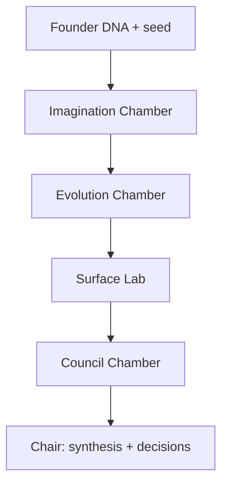

# Council and Debate Protocol

## Contents

1. Council topology
2. Core roles
3. Neutral case file
4. Cell contracts
5. Debate rounds
6. Scaling and fallback
7. Chair adjudication

## 1. Council topology

Use sequential chambers and parallel cells to create true intellectual independence without requiring one agent per title.



The primary agent owns framing, source integrity, cross-examination, adjudication, user interaction, and the final ledger. Cells advise; they do not decide.

In `IMAGINATION` and `DEEP`, run First-Principles Inventor, Human Meaning Anthropologist, and Alien Systems Thinker independently before evolution. Run Mutator, Crossover Designer, and Extinction Selector after their positions are frozen. Use [imagination-and-evolution.md](imagination-and-evolution.md) for contracts. Do not let feasibility erase conceptual diversity before the Council wave.

## 2. Core roles

Assign these hats inside cells as relevant. Do not force irrelevant roles.

| Role | Mandate | Characteristic question | Forbidden behavior |
| --- | --- | --- | --- |
| Founder-Intent Guardian | Preserve ambition, taste, constraints, and non-goals | What must remain true even if the mechanism changes? | Defending every original feature |
| First-Principles Visionary | Remove inherited assumptions and propose new mechanisms | If nothing existed, how would this outcome be created? | Pure futurism without a causal mechanism |
| Human/JTBD Anthropologist | Model actors, motivation, trust, habits, social meaning | What is the real progress and emotional risk? | Inventing research evidence |
| Analogist | Transfer mechanisms from distant domains | Where has an isomorphic problem been solved? | Copying surface features |
| Strategist | Define positioning, alternatives, wedge, advantage | Why this, for whom, against what alternative? | Calling novelty a moat |
| Economist/Incentive Designer | Examine value flows, pricing logic, externalities, gaming | Who pays, gains, loses, and changes behavior? | Assuming aligned incentives |
| Operator | Expose dependencies, workflows, bottlenecks, service burden | What has to happen repeatedly for this to work? | Solving everything with headcount |
| Systems Architect | Map feedback loops, boundaries, states, scale effects | What becomes coupled or unstable? | Premature implementation design |
| Contrarian | Challenge the dominant premise and fashionable default | What if the opposite is true? | Contradiction for entertainment |
| Red Team/Premortem | Produce causal failure stories and kill criteria | Why does this fail despite competent execution? | Vague pessimism |
| Trust/Ethics Examiner | Inspect power, misuse, exclusion, privacy, and legitimacy | Who can be harmed or manipulated? | Generic ethics boilerplate |
| Experiment Designer | Convert uncertainty into decisive learning | What is the cheapest test that could change the decision? | Vanity metrics |
| Integrator | Recombine mechanisms and preserve tensions | Which strengths coexist without canceling each other? | Averaging everything |
| Council Chair | Judge with declared criteria and founder intent | What should we believe and do now? | Hiding uncertainty or outsourcing judgment |

## 3. Neutral case file

Give every independent cell the same neutral packet:

```markdown
# Case
Idea:
Desired transformation:
Actors/users:
Context and why now:
Locked decisions:
Constraints:
Non-goals:
Known evidence and sources:
Known unknowns/conflicts:
Requested depth:
Your cell mandate:

Return:
1. Three strongest observations
2. Two materially distinct proposals or repairs
3. Strongest objection to the current idea
4. Hidden assumptions
5. Disconfirming evidence or falsifier
6. Confidence by claim
7. One question for another cell
```

Never include “the likely answer is,” the Chair's preferred direction, or other cells' early conclusions.

## 4. Cell contracts

### Expansion Cell

Bundle First-Principles Visionary, Human/JTBD Anthropologist, and Analogist.

Required outputs:

- problem-level reframe;
- at least three orthogonal mechanisms;
- one inversion;
- one adjacent/distant analogy with transferred mechanism;
- the most ambitious coherent version;
- the smallest version preserving the core magic.

### Reality Cell

Bundle Strategist, Economist, Operator, and Systems Architect.

Required outputs:

- value and incentive map;
- strategic alternatives and wedge;
- bottlenecks and recurring operational burden;
- feasibility dependencies;
- what breaks at scale;
- recommended constraint or sequencing change.

### Adversarial Cell

Bundle Contrarian, Red Team, and Trust/Ethics Examiner.

Required outputs:

- strongest case against the idea;
- premise inversion;
- premortem with causal chain;
- abuse/gaming and second-order effects;
- kill criteria;
- repairs and experiments for survivable issues.

### Integration/Experiment Cell

Use in DEEP mode or a second wave. Bundle Integrator and Experiment Designer.

Required outputs:

- tension-preserving syntheses;
- dependency between decisions;
- evidence priority;
- cheapest decisive experiments;
- handoff readiness gaps.

## 5. Debate rounds

### Round A — Independent positions

Run cells in parallel. Freeze their outputs before cross-pollination. The Chair extracts claims and labels them `X`, `R`, or `A` without status hierarchy.

### Round B — Steelman and cross-examination

Give each cell the other cells' raw claims or an anonymized claim set. Require:

1. Steelman one opposing claim.
2. Identify one claim they now accept and why.
3. Refute one claim causally.
4. Name missing evidence.
5. Revise one of their own positions.

No cell may answer only “I agree.”

### Round C — Crux resolution

The Chair identifies cruxes: propositions where disagreement would disappear if resolved. For each crux:

- competing claims;
- assumptions and evidence;
- whether it is a value choice, factual uncertainty, model difference, or time-horizon difference;
- resolution: decide, research, experiment, defer, or accept tension.

### Round D — Synthesis

Ask the Integrator to build 1–3 coherent concepts from surviving mechanisms. The Adversarial Cell gets a final veto memorandum, but not veto power. The Chair adjudicates.

## 6. Scaling and fallback

| Available independent workers | Topology |
| ---: | --- |
| 3+ | Expansion, Reality, Adversarial in parallel; Chair stays primary. |
| 2 | Expansion and Reality+Adversarial; Chair explicitly runs the missing counterpass. |
| 1 | One Contrarian/Red Team independent pass; Chair runs expansion and reality locally. |
| 0 | Use separated local passes with context resets and claim labels; state that no actual subagents were available. |

For high-stakes or DEEP sessions, run the Integration/Experiment Cell only after the first debate. Do not keep agents alive merely to preserve the appearance of a team.

## 7. Chair adjudication

The Chair must:

- protect locked founder intent while allowing the mechanism to change;
- distinguish value disagreements from factual disagreements;
- expose minority reports that remain plausible;
- weight arguments by evidence and causal quality, not rhetorical confidence;
- refuse false balance when one position is materially stronger;
- state recommendation, confidence, disconfirmers, and revisit trigger;
- retain rejected ideas in the ledger with reason, preventing circular repetition;
- translate debate into decisions and experiments, not reproduce a transcript.

Use concise attributed excerpts or paraphrases. Do not manufacture quotes from cells.
