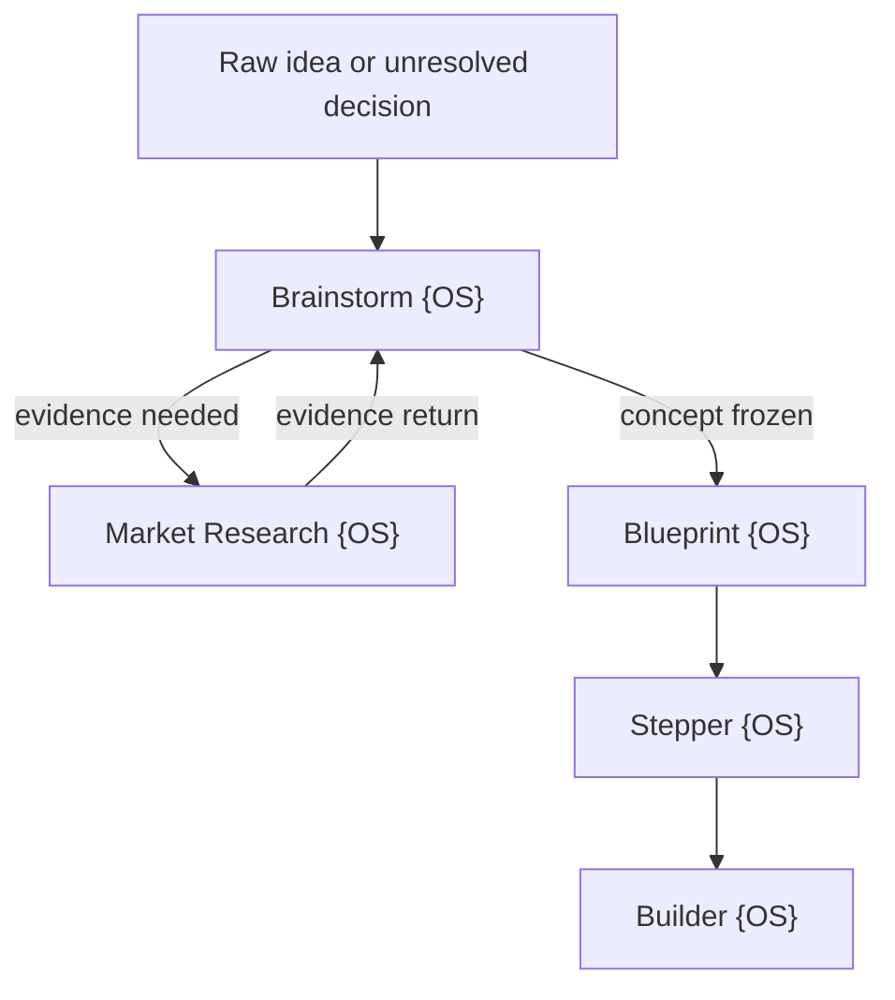

# Omega OS Integration

## Contents

1. Role in the OS graph
2. Extension contract
3. Commands and events
4. State ownership
5. Handoff schemas
6. Installation behavior

## 1. Role in the OS graph

Brainstorm {OS} is the exploration and decision compiler at the beginning of the Omega OS product graph.



Brainstorm owns concept versions and its ledgers. It never edits downstream normative artifacts in place.

## 2. Extension contract

Use extension key `brainstorm-os` and semantic contract version `3.0.0`.

Inputs:

- raw user idea or decision;
- project ID and boundary;
- source references and artifacts;
- prior Brainstorm session, if any;
- locked founder decisions;
- requested mode and output target;
- tool/agent capacity.

Outputs:

- versioned session JSON;
- Founder DNA, alternate frames, idea genomes, generations, incubation, and portfolio state;
- Surface Lab decision for mobile, web, desktop, multi-surface, chat/API, physical, service, ambient, or no-interface embodiments;
- human-readable Council brief;
- quality scorecard;
- research, Blueprint, decision, or creative handoff;
- continuation checkpoint.

## 3. Commands and events

Map conversational commands to operations:

| Command | Operation | Event emitted |
| --- | --- | --- |
| `/brainstorm` | create/recover session | `brainstorm.session.started` |
| `/frame-fission` | generate alternate frames | `brainstorm.frame.fissioned` |
| `/evolve` | record an evolutionary generation | `brainstorm.generation.completed` |
| `/surface` | compare/select embodiment | `brainstorm.surface.selected` |
| `/challenge` | run named challenge cycle | `brainstorm.round.completed` |
| `/research` | generate evidence agenda | `brainstorm.research.requested` |
| `/converge` | adjudicate surviving ideas | `brainstorm.convergence.proposed` |
| `/freeze` | lock concept version | `brainstorm.concept.frozen` |
| `/handoff research` | emit research contract | `brainstorm.handoff.research.ready` |
| `/handoff blueprint` | emit Blueprint contract | `brainstorm.handoff.blueprint.ready` |
| `/audit` | evaluate session quality | `brainstorm.audit.completed` |

Recommended event envelope:

```json
{
  "event_id": "uuid",
  "event_type": "brainstorm.round.completed",
  "occurred_at": "ISO-8601",
  "project_id": "string",
  "session_id": "string",
  "concept_version": "semver",
  "actor": "user-or-agent-id",
  "payload_ref": "durable-artifact-ref",
  "correlation_id": "string",
  "causation_id": "string"
}
```

## 4. State ownership

Brainstorm state is append-oriented. Keep rejected/superseded objects for lineage.

- Omega may index and route state but must not rewrite Brainstorm IDs.
- Market Research returns evidence keyed to Brainstorm hypothesis IDs.
- Blueprint consumes only frozen/provisional concept decisions and must preserve provenance.
- Stepper and Builder never reopen Brainstorm decisions directly; they emit governed change requests upstream.
- Private reasoning is not persisted. Persist claims, evidence, concise rationale, decisions, and tool receipts only.

## 5. Handoff schemas

### Research request

Required fields: project/session/version, boundary, selected/alternative ideas, ranked hypotheses, research questions, known evidence, target actors, market/category hypotheses, decision thresholds, exclusions, and return mapping.

### Blueprint input

Required fields: executive concept truth, founder intent/non-goals, Founder DNA used, alternate frames, selected genome and lineage, selected mechanism, actors/JTBD hypotheses, value and experience principles, primary surface and alternative, multi-surface role map when relevant, locked/provisional decisions, constraints, trust/incentive rules, evidence, risks/tensions, experiments/open questions, rejected/incubated directions, and sources.

### Change request from downstream

Required fields: originating artifact, affected Brainstorm IDs, discovered constraint/evidence, impact, proposed reopen scope, urgency, and whether work can continue safely.

Never send a transcript dump as a handoff.

## 6. Installation behavior

Use `scripts/install_omega_os.py` only after the user provides or authorizes a target Omega OS directory.

The installer:

- supports `--dry-run`;
- resolves an explicit target rather than an environment-variable guess;
- installs under `extensions/brainstorm-os`;
- refuses to overwrite by default;
- excludes caches and transient files;
- writes an installation receipt containing source version and file hashes;
- leaves unrelated Omega OS files untouched.

After installation, register the manifest in `assets/omega-extension.json` using the host's normal extension registry. If the host registry format differs, adapt explicitly rather than guessing and overwriting it.
