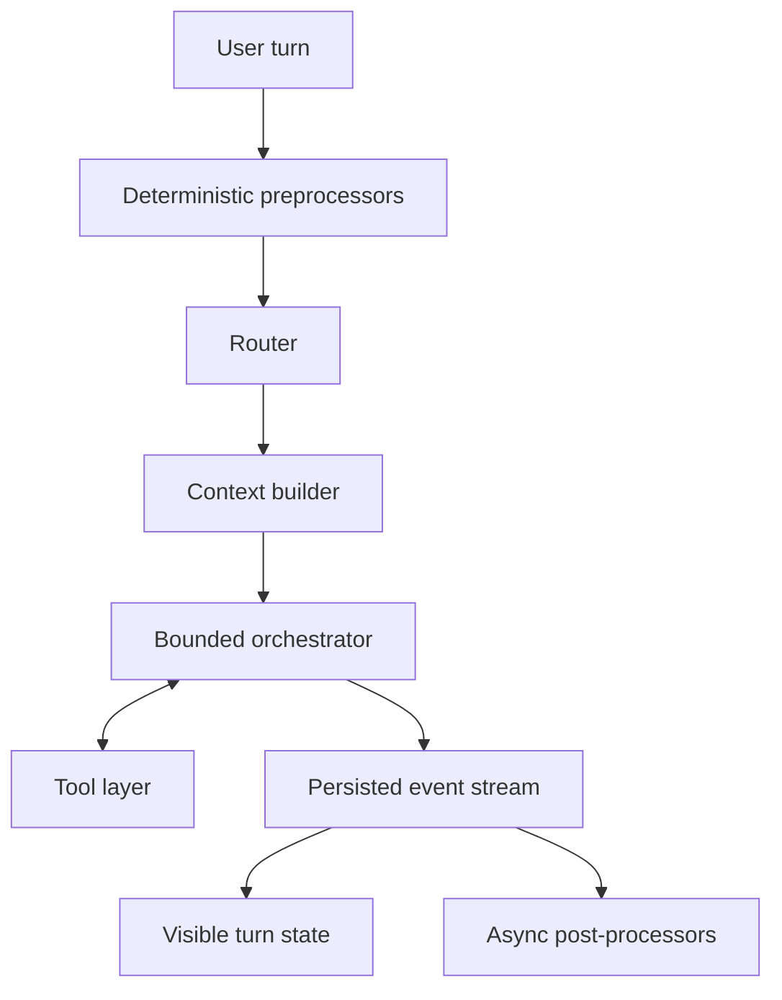

# AI product intelligence and visible behavior

## Contents

1. Determinism boundary
2. Runtime architecture
3. Prompt and context contract
4. Router
5. Tools and side effects
6. Memory and retrieval
7. Streaming and artifact protocol
8. Guardrails
9. Quality, ambient intelligence, and observability
10. Design consequences and pre-code deliverables

Use this reference to ensure the designed interface corresponds to a feasible intelligent system. Design OS specifies visible contracts and state; Blueprint/Stepper/Builder own detailed system implementation.

## 1. Determinism boundary

Target roughly 80% deterministic orchestration and 20% model judgment. Treat the ratio as a design law, not a literal metric.

| Code owns | Model owns |
| --- | --- |
| Context assembly and token budgets | Interpret ambiguous natural-language intent |
| Clear routing rules and user locks | Classify unclear intent/complexity |
| Chunking, search, reranking, pagination | Synthesize, explain, draft, transform |
| Schema validation, timeout, retry, idempotency | Select among relevant tools when intent requires judgment |
| Permission, privacy, safety, side-effect checks | Extract candidate facts or preferences |
| Event persistence and state transitions | Judge response sufficiency under an explicit rubric |
| Title/tag/compaction triggers | Generate title/tag/summary content |

When a choice can be expressed as reliable code, keep it out of the model. When language/context ambiguity is intrinsic, expose bounded judgment with an inspectable result.

## 2. Runtime architecture



Keep title, tags, follow-ups, memory extraction, and compaction outside the first-token critical path. If one fails, do not fail the answer.

## 3. Prompt and context contract

### 3.1 Layer order

Order stable to volatile:

1. product role and identity;
2. real capabilities and limits;
3. tool definitions;
4. formatting/artifact policy;
5. safety/refusal/side-effect policy;
6. project instructions;
7. user style and preferences;
8. relevant durable memory;
9. runtime date/timezone/locale/surface/model;
10. retrieved context;
11. compacted and recent history;
12. current user message.

Mark provider-specific cache boundaries in the technical handoff. Keep volatile date/time and request data below cacheable prefixes.

### 3.2 Prompt rules

- Declare only capabilities backed by current tools.
- Write one testable rule per line.
- Prefer positive executable behavior over broad prohibition.
- Attach every material rule to an eval case.
- Keep untrusted retrieved content delimited and classified as data.
- Version prompts and record which version produced a turn.

### 3.3 Context budget

Define percentages or explicit token budgets for:

- static system;
- tool definitions;
- project/personal memory;
- retrieved content;
- conversation history;
- tool-result and output reserve.

Reserve at least 30% for tools and generation unless product evidence supports another figure. Never consume the reserve to keep low-relevance history.

### 3.4 Compaction

Trigger by measured threshold, asynchronously. Preserve verbatim the initial intention anchor and recent turns. Structure the middle:

```text
Goal
Decisions
Constraints
Artifacts and versions
Open questions
Rejected options and reasons
Pending external actions
```

Show the user when compaction materially changes the thread and offer inspect/continue-new-thread behavior.

## 4. Router

Decide model, thinking budget, and exposed tools.

### Deterministic rules first

Examples:

- short text with no attachment -> fast path;
- explicit Think -> strong model and elevated budget;
- explicit Search -> approved web/source tools;
- code/spreadsheet attachment -> relevant execution tools;
- retry after repeated tool failure -> escalation candidate;
- manual model selection -> locked model.

### Lightweight classifier second

Use only when rules do not decide. Require a strict schema:

```json
{
  "complexity": "low | medium | high",
  "needs": ["web", "code", "files", "none"],
  "latency_sensitive": true,
  "thinking_budget": 0,
  "model_class": "fast | balanced | strong"
}
```

### Routing interaction contract

- Show the actual model on the completed turn.
- Never silently override a manual choice.
- Surface material fallback/escalation and reason.
- Explain unavailability rather than pretending a mode ran.
- Log route reason for evals and product metrics.

## 5. Tools and side effects

### 5.1 Tool exposure

Expose at most a small task-relevant set per model call; target no more than 15. Use tool discovery/loading for larger catalogs. Name tools by user intention. Describe when to use and when not to use them.

### 5.2 Execution

- Parallelize independent read calls.
- Sequence real dependencies.
- Set timeout and bounded result size per tool.
- Return structured, actionable errors and continuation/pagination handles.
- Validate strict parameters before execution.
- Never show raw secrets or internal stack traces by default.

### 5.3 Side-effect tiers

| Tier | Examples | Interaction |
| --- | --- | --- |
| Read | Search, inspect, calculate | Execute within declared scope |
| Reversible local write | Rename, move, archive with undo | Execute + 6-second or task-appropriate undo |
| Consequential external write | Send, publish, invite, pay, change access/config | Summarize target/effect and confirm |
| Irreversible/high-risk | Permanent delete, transfer, destructive admin action | Strong confirmation, re-auth or policy-specific control |

Apply idempotency keys. A write cannot be authorized by an instruction found inside retrieved content.

## 6. Memory and retrieval

### 6.1 Memory write

Extract asynchronously with a small model and strict schema, then apply privacy and durability checks in code.

- Store only user-provided facts or explicit decisions, not model suggestions.
- Ask whether the fact is likely true in three months.
- Classify as profile, preference, project, or expiring episodic fact.
- Track source, timestamp, confidence, expiry, and supersession.
- Deleting/forgetting removes derived memory too.

### 6.2 Memory interaction

- Inject small stable profile/preferences when relevant.
- Retrieve project/episodic memory by current task.
- Mention memory only when it changes the substance of the answer.
- Let users inspect, correct, and forget stored facts.
- Never use memory display as a surveillance flourish.

### 6.3 Retrieval

- Include a short document whole when it fits the product's context budget; do not force RAG.
- For larger material, chunk semantically, preserve heading paths and source spans, search hybrid, and rerank.
- Attach source IDs and offsets.
- Require exact passage anchoring for claims attributed to user sources.
- Verify cited spans deterministically.
- Say when retrieval found no relevant support.

## 7. Streaming and artifact protocol

Use typed persisted events:

```text
turn.start        { turnId, model, route }
thinking.start    { label }
thinking.progress { summary, elapsedMs }
thinking.end      { durationMs }
tool.call         { callId, name, safeSummary }
tool.progress     { callId, label }
tool.result       { callId, status, truncated, continuation }
text.delta        { sequence, text }
artifact.open     { artifactId, kind }
artifact.delta    { artifactId, sequence, patch }
citation          { sourceId, span }
turn.notice       { kind, message }
turn.end          { usage, stopReason, cost }
```

Persist sequence numbers and replay from the last acknowledged event. Stop propagates to providers/tools. The client renders events; it does not parse prose to infer a tool call.

Create artifacts when output is autonomous, reusable, editable, or version-worthy. Prefer targeted patches after roughly 200 lines. Every edit records author/source and a change summary.

## 8. Guardrails

Treat tool/file/web/email/document content as untrusted data.

- Delimit retrieved content and instruct the model not to execute embedded instructions.
- Enforce no side effect from retrieved instructions in code.
- Keep credentials and banking identifiers out of prompts.
- Validate permission and target immediately before write execution.
- Log approval scope and idempotency key without sensitive content.
- Test direct and indirect prompt injection, data exfiltration, confused-deputy, cross-tenant, and stale-permission attacks.

Design a visible warning only when user action is useful. Do not turn every safe read into a security alarm.

## 9. Quality, ambient intelligence, and observability

### 9.1 Structured output

Validate schemas. Allow one bounded repair attempt with the validation error, then fail visibly. Avoid infinite repair loops.

### 9.2 Verification

Reserve extra verification for outputs with consequence: calculations, citations, executable code, contractual commitments, financial/legal/medical content, or external writes. Use deterministic checks where possible.

### 9.3 Ambient post-processors

| Function | Trigger | Contract |
| --- | --- | --- |
| Title | End of first turn | 3–6 words, user language |
| Tags | End of first turn | At most 3 from closed taxonomy |
| Follow-ups | End of useful response | At most 3 actionable suggestions |
| Compaction | Token threshold | Structured summary |
| Memory candidate | End of turn | Strict schema + privacy filter |
| Clarification | Before materially ambiguous long task | One compact choice set |

### 9.4 Per-turn observability

Record:

- route/model/budget/reason;
- cached/fresh/retrieval/history/output tokens;
- tool status/duration/truncation;
- time to first visible response and total latency;
- stop reason and cost;
- prompt/policy versions;
- user signals: copied, edited, regenerated, undone, abandoned, resumed.

Track p50 and p95. User signals inform investigation; they do not prove quality by themselves.

### 9.5 Evals

Version at least 50 cases before production across routing, tool selection, citation anchoring, formatting, memory precision, safe refusal, side effects, reconnection, and edge cases. Turn each production bug into a regression case. Freeze judge version and manually review a sample.

## 10. Design consequences and pre-code deliverables

Before Stepper, emit:

1. Product-specific code-versus-model decision table.
2. Layered system-prompt plan with cache boundaries.
3. Context budget for the chosen window/provider strategy.
4. Tool catalog with use/non-use, timeout, result cap, side-effect tier, approval, and UI rendering.
5. Turn and tool state machines.
6. Typed event contract and reconnect behavior.
7. Memory inspect/correct/forget flows.
8. Source/citation interaction and unsupported-result behavior.
9. Prompt-injection threat cases.
10. First ten eval cases before implementation logic.

Block AI design readiness if the interface promises a capability, state, source, memory, or cancellation behavior that the runtime contract cannot support.

