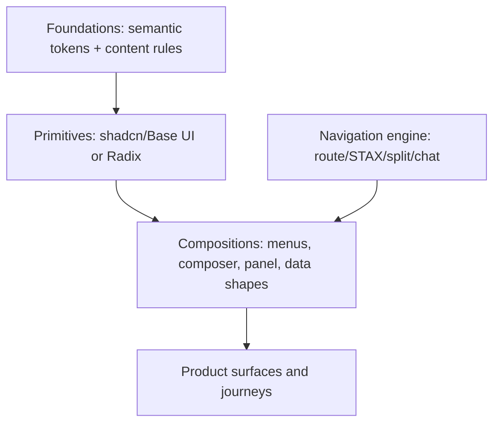

# STAX and shadcn architecture

## Contents

1. Source posture
2. Layered design-system architecture
3. STAX fitness test
4. Canonical STAX contract
5. Hybrid patterns
6. shadcn component mapping
7. Registry and machine-readable metadata
8. Adoption and validation

## 1. Source posture

Use [agentik-os/stax](https://github.com/agentik-os/stax) as a navigation and UI-language source, not a universal mandate. The reference audit for Design OS was performed on commit `557d6ee969c825b7d05c72ea920281421785b876` on 2026-08-10. Resolve and record a current tag or full commit before vendoring or building against it.

At the audited ref, treat these paths as source truth:

| Concern | STAX path |
| --- | --- |
| Framework overview | `README.md` |
| Current semantic model and invariants | `CONCEPT-BRIEF.md` |
| Navigation pedagogy and responsive projection | `PANEL-LOGIC.md` |
| Pixel/shape contract | `DESIGN-SPEC.md` |
| Agent contract | `agents.md` |
| Pure reducer/codec | `frameword/packages/panels-core/src/index.ts` |
| React bindings, URL/storage | `frameword/packages/panels-react/src/index.tsx` |
| Scaffolder | `frameword/packages/create-stax-app/` |
| Migration/audit CLI | `frameword/packages/stax-migrate/` |
| Reference app and tests | `frameword/apps/crm-specimen/` |

Do not claim unshipped concept packages exist. The audited concept brief explicitly marks `@frameword/ui`, `panels-next`, and `panels-convex` as future/non-delivered concepts; use the code and current package manifests to establish reality.

Use [shadcn/ui](https://ui.shadcn.com/docs) as editable component source and registry schema. For new projects, prefer the current Base UI default unless the existing stack already uses Radix or a component requires Radix. Keep the product-level API stable so the primitive backend can be chosen deliberately.

## 2. Layered design-system architecture

Keep four layers separate:



- Foundations define meaning, not components.
- Primitives provide accessible behavior and open code.
- Compositions encode product interaction laws.
- Surfaces answer user questions using domain data.
- Navigation is chosen per product/surface and does not leak into domain objects.

Never create a monolithic `Card` variant that mixes all four layers.

## 3. STAX fitness test

Score each statement `0` false, `1` sometimes, `2` central:

| Criterion | Question |
| --- | --- |
| Context preservation | Does opening detail currently destroy a useful parent/selection? |
| Semantic depth | Do users traverse three or more meaningful related levels? |
| Comparison/reference | Do users keep related records visible while exploring? |
| Share/resume | Is a serialized deep workspace materially valuable? |
| Entity graph | Is the product organized around related resources rather than one linear task? |
| Power navigation | Do keyboard, command palette, pin/reference, and resume produce leverage? |
| Multi-host projection | Must the same semantic path work as columns on desktop and push navigation on phone? |
| Stateful work | Does the user maintain a “train of thought” rather than visit isolated destinations? |

Interpretation:

- `12–16`: STAX may be the primary application navigation model.
- `7–11`: use STAX selectively for entity exploration/workspaces.
- `0–6`: use routes, hub/drill, split view, editor, canvas, or chat without STAX core.

Apply vetoes even with a high score:

- linear onboarding, authentication, checkout, payment authorization, or a short irreversible ceremony;
- focused creation requiring a full-canvas/editor and minimal surrounding context;
- simple consumer utility with shallow information architecture;
- accessibility/platform constraints the selected host cannot satisfy;
- team lacks capability to test URL/state/focus laws and would ship a decorative panel rail.

Document `DDEC-###` with score, vetoes, and selected scope. Never use “STAX because it looks premium.”

## 4. Canonical STAX contract

### 4.1 Semantic state

Prefer the current semantic model from `CONCEPT-BRIEF.md` over the older flat-stack pedagogy:

- one `RootPanel` per workspace/space;
- `DetailPanel` instances have explicit parent semantics;
- `ContextPath` derives from parent links;
- `ContextRail` renders the active ancestry;
- `ReferenceRail` holds detached retained references;
- visual order never proves ancestry;
- navigation state is versioned JSON only;
- focus and context leaf are explicit and independent;
- URL codec round-trips and degrades to the resolved ancestor;
- device-local projection preferences do not enter shareable navigation state.

Minimum panel instance contract:

```ts
type PanelTarget = {
  panelType: string
  resourceKey: string
  params: Record<string, JsonValue>
}

type PanelInstance = {
  instanceId: string
  target: PanelTarget
  spaceId: string
  parentInstanceId: string | null
  role: "root" | "detail"
  retention: "preview" | "retained"
  placement: "context" | "reference"
}
```

Do not store React components, callbacks, fetched rows, or backend imports in navigation state.

### 4.2 Intent API

Name public commands by user intent:

`openSpace`, `openDetail`, `revealPanel`, `focusPanel`, `navigateUp`, `pinPanel`, `unpinPanel`, `resumeReference`, `closePanel`, `closeBranch`, `reconcileLocation`, `restoreWorkspace`, `openUtility`.

Keep reducer operations pure. Side effects belong to adapters.

### 4.3 Panel anatomy

Use a labelled region with:

- identity/navigation bar;
- independently scrollable body without internal horizontal overflow;
- persistent footer action zone when actions exist.

STAX's “footer is the action zone” is a selected composition law. Do not place primary write actions randomly in headers and bodies after adopting it. Read-only panels may omit the footer.

### 4.4 Width and projection

Declare size by `panelType`, not instance style. STAX's audited visual grammar uses registry classes `S`, `M`, `L`, `XL`, and `XXL`; verify current values before implementation.

Keep one semantic state with multiple hosts:

- expanded: adjacent context panels and separate references;
- medium: focused panel plus limited ancestor/reference affordance;
- compact: one focused panel with semantic Navigate Up and a reference tray.

Use container queries inside panels. At 200% zoom, reflow to a single-panel host before content clips.

### 4.5 Mandatory states

Every panel/resource supports at least:

`loading`, `empty`, `error`, `not_found`, `permission_lost`, `offline`, `stale`, and `deleted_resource` where the domain permits them.

Every element defines default, hover, focus/active, empty, loading/skeleton, and error behavior where applicable.

### 4.6 Focus and dismissal

- Opening focuses the panel heading or first meaningful control.
- Closing restores the originating drill trigger when possible.
- Escape dismisses overlays before drawer, then active panel, then root/home according to the declared host.
- Browser Back reconciles a destination URL; it is not assumed to equal semantic parent.

## 5. Hybrid patterns

### Chat + artifact

Use a stable conversation column and a resizable artifact/source surface. STAX may power entity/reference panels outside the artifact surface, but the chat tree remains its own model.

### Collection + contextual detail

Keep collection selection visible; open details as a preview panel. Pin/retain only when comparison or later reference has product value.

### Route shell + STAX workspace

Let the framework router own top-level public pages/auth/settings. Mount a STAX workspace as one client surface with its own serialized fragment/state. Define who owns Back, deep link, and unsaved guards.

### Canvas + inspector

Treat canvas as one wide/fill panel or focused surface. Selecting a node opens an inspector through the same navigation intent API. Canvas history remains separate from workspace undo when focused.

### Mobile push host

Project the same context path into one surface. Do not preserve desktop panels off-screen and call it responsive. References become a discoverable tray; Navigate Up is semantic; browser Back follows route history.

### When a modal remains correct

Use a modal/alert dialog for a bounded interruption requiring attention, especially consequential confirmation or authentication. STAX's no-modal ambition does not override platform semantics or safety.

## 6. shadcn component mapping

Map by behavior:

| Need | Start with | Notes |
| --- | --- | --- |
| Action/menu list | `DropdownMenu`, `ContextMenu` | One action registry; shared entries |
| Unified search/actions | `Command` inside `Dialog` or dedicated surface | Stable async ordering; accessible combobox/list behavior |
| Short anchored supplemental UI | `Popover` | Keep focus semantics and dismissal explicit |
| Consequential confirmation | `AlertDialog` | Do not use for reversible local actions |
| Bounded task/inspection | `Dialog` | Modal only when background is intentionally inert |
| Edge overlay | `Sheet` or `Drawer` | `Sheet` is an overlay; never call a STAX panel a Sheet |
| Responsive modal/drawer | `Dialog` + `Drawer` composition | Preserve one semantic task |
| Resizable artifact/split view | `Resizable` | Persist presentation width; keyboard-operable handle |
| App navigation | `Sidebar` plus project-specific shell | Do not copy example IA blindly |
| Long region | native overflow or `ScrollArea` | Avoid nested scroll traps |
| Forms | `Field`, labels, descriptions, errors | Name/description/error contracts |
| Tabs | `Tabs` only for peer views of same context | Do not use to hide hierarchy or workflow steps |
| Disclosure | `Collapsible`/`Accordion` | Preserve state and heading hierarchy |
| Toast | `Sonner`/status region | Undo and lightweight completion; never sole error evidence |

Inspect current shadcn documentation and project `components.json` before naming APIs. New shadcn projects default to Base UI at the audited 2026-08 date; Radix remains supported.

## 7. Registry and machine-readable metadata

Maintain `components.json` for shadcn configuration and a product component manifest with:

```json
{
  "id": "COMP-001",
  "name": "ContextChip",
  "kind": "composition",
  "primitiveBackend": "base-ui",
  "registryItem": "@product/context-chip",
  "states": ["default", "hover", "focus", "stale", "error"],
  "variants": ["file", "url", "project", "quote"],
  "tokens": ["surface.context", "border.subtle", "text.secondary"],
  "a11y": ["removable token", "preview on focus"],
  "flows": ["FLOW-012"],
  "tests": ["EVAL-044"]
}
```

Use shadcn registry item types intentionally:

- `registry:base` for a complete base system;
- `registry:ui` for primitives;
- `registry:component` for simple product components;
- `registry:block` for multi-file compositions;
- `registry:hook`, `registry:lib`, `registry:theme`, and `registry:style` for their exact purposes.

Pin third-party or GitHub registry dependencies to a tag or full commit for reproducible handoffs. Do not vendor opaque copied code without provenance.

## 8. Adoption and validation

For a new STAX app, inspect current `create-stax-app` help and use its scaffold rather than hand assembly when appropriate. For existing products, use migration/audit tools only after reading their current contracts and preserving backend behavior.

Design gates:

- STAX fitness decision recorded;
- semantic state distinct from projection state;
- URL/history/focus/undo ownership defined;
- component registry maps every custom composition;
- Base UI/Radix selection explicit;
- light/dark/compact/expanded behavior tested;
- panel state and codec law tests planned;
- no hardcoded panel width or duplicated derived data;
- no missing capability from a migrated surface;
- no framework doctrine overriding user goal, safety, or accessibility.

