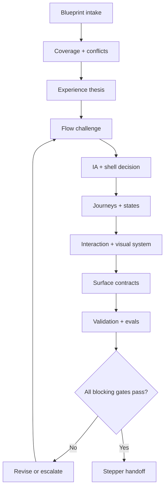

# Design {OS} compiler workflow and gates

## Contents

1. Input contract
2. Phase graph
3. Detailed phases
4. Gate catalog
5. Change control
6. Completion semantics

## 1. Input contract

Treat the Blueprint as upstream product truth, not as a wireframe order. Minimum viable intake:

| Input | Required | Failure policy |
| --- | --- | --- |
| Product objective and target outcomes | Yes | Return to Blueprint |
| Actors and permissions | Yes for multi-user or privileged products | Block affected flows |
| Core features/actions | Yes | Create missing-action report |
| Business/domain invariants | Yes when consequential | Block contradictory UI |
| Target surfaces/platforms | Yes | Declare a reversible assumption only if low-risk |
| NFRs and trust constraints | Yes for regulated, financial, health, identity, or AI write flows | Block readiness |
| Existing brand/component/code assets | Optional | Inventory when present |
| Research/analytics | Optional | Label absence; do not fake evidence |

Normalize incoming IDs. Preserve upstream requirement and decision IDs. When no IDs exist, create temporary `UP-###` references and mark them `ASSUMPTION`, not Blueprint truth.

## 2. Phase graph



Do not compress phases D through H into “make screens.” Each phase resolves a different class of uncertainty.

## 3. Detailed phases

### P0 — Workspace and provenance

Create a version header:

```yaml
design_os_version: "1.0"
project: "..."
mode: "FULL"
blueprint_version: "..."
design_revision: "D0"
status: "IN_PROGRESS"
sources:
  - id: "SRC-001"
    kind: "blueprint"
    location: "..."
    version: "..."
```

Record repository commit/tag for code-backed sources. Record STAX commit if its implementation is used. Never say “latest” in a durable handoff without the resolved ref.

### P1 — Blueprint coverage and conflict scan

Extract:

- actors, roles, permissions, membership/plan gates;
- jobs and measurable outcomes;
- features, actions, domain entities, invariants;
- lifecycle events, integrations, AI/tool behaviors;
- security, privacy, performance, locale, platform constraints;
- upstream unknowns, rejected ideas, and approval owners.

Build a preliminary row per critical requirement:

| Upstream ID | Actor | Outcome | Candidate flow | Risk | Missing truth |
| --- | --- | --- | --- | --- | --- |

Resolve contradictions in business rules upstream. Design may propose presentation, but cannot choose who may pay, invite, publish, transfer money, or access private data without an owner.

### P2 — Experience thesis and principles

Write:

- one interaction thesis;
- five to nine `EXP-###` principles tied to product evidence;
- rejected anti-principles such as “everything in chat,” “everything in panels,” “dashboard first,” or “mobile equals compressed desktop”; 
- a single primary user question for each major surface family.

Reject aesthetic-only principles (“clean,” “beautiful”) unless converted into observable rules.

### P3 — Flow inventory and challenge

Inventory every user-visible action, not only screens. Group actions into flows. Rank:

`priority = outcome_value × frequency × urgency × risk_modifier`

Use ordinal 1–5 inputs. Document the score as a prioritization aid, never as scientific truth.

For every P0 flow, define:

- trigger and entry surface;
- actor, permissions, preconditions;
- desired outcome and success evidence;
- current/proposed step graph;
- information required from the user;
- decisions and context switches;
- waiting/async states;
- alternate, recovery, cancellation, and return paths;
- analytics events and experience guardrails.

Run the friction challenge in [flow-challenge.md](flow-challenge.md).

### P4 — Entity, IA, and shell model

Create an entity relationship/containment model before navigation. Separate:

- nouns people manage;
- collections people scan;
- tasks people complete;
- global utilities used across nouns;
- ephemeral overlays;
- persistent workspaces or contexts.

Choose navigation per surface family, not necessarily one shell for the entire product. A justified hybrid is often correct:

- routes/pages for stable destinations and shareable top-level areas;
- hub-and-drill for collections and details;
- STAX rails for deep contextual exploration/comparison;
- split view for master/detail with bounded depth;
- canvas for spatial graphs and free-form arrangement;
- focused editor for creation requiring space;
- chat-first for ambiguous intent and orchestration;
- drawers/popovers for transversal or ephemeral work.

Define ownership of URL, browser history, focus, scroll, selected item, open panels, and overlay state. Each has exactly one source of truth.

### P5 — Journey and state compilation

Represent branching or sequence-heavy flows with Mermaid. Keep prose for linear two-step behavior.

Define a state machine for every consequential or asynchronous flow. Minimum states when relevant:

`idle -> editing -> validating -> submitting -> queued -> processing -> success | partial | error | cancelled`

Add domain states such as `permission_lost`, `offline`, `stale`, `conflict`, `deleted`, `expired`, `payment_required`, `rate_limited`, and `needs_confirmation` only when supported by product truth.

Define which transitions are optimistic, persisted, retryable, idempotent, resumable, or compensated.

### P6 — Interaction architecture

Define:

- command/action registry and keyboard map;
- menus, nesting, anchoring, placement, and search behavior;
- focus entry/restoration and Escape precedence;
- selection, multiselect, drag/drop, paste, upload, and context tokens;
- optimistic feedback, progress, notifications, undo, retry, and conflict resolution;
- chat/agent behavior through [interaction-system.md](interaction-system.md) when relevant;
- backend-visible AI states through [ai-intelligence.md](ai-intelligence.md) when relevant.

Every promised shortcut must have a component owner and an `EVAL-###` case.

### P7 — Visual and component system

Define a visual thesis tied to brand and use context. Build semantic foundations before component variants:

- color roles and state contrast;
- typography roles and content width;
- spacing/density and touch targets;
- borders, radii, elevation, material, and layering;
- motion duration/easing and reduced-motion equivalent;
- icons, imagery, data visualization, and empty-state illustration policy;
- light, dark, forced-colors, and print behavior where relevant.

Map components to shadcn/Base UI or Radix, STAX, and custom code. Keep a component registry with owner, variants, states, composition rules, and prohibited misuse.

### P8 — Surface contracts

Create one contract per `SURF-###`:

```text
Identity and route/panel target
Purpose and primary user question
Actors and permission matrix
Entry/exit points and related flows
Regions and hierarchy
Actions by priority and placement
Data and content dependencies
State matrix
Responsive transformations
Keyboard/touch/focus behavior
Telemetry and privacy
Components/tokens used
Acceptance and visual-regression criteria
```

Do not create a screen for a transient state if a menu, popover, inline edit, drawer, or existing detail surface better preserves context.

### P9 — Validation and Stepper compilation

Run all gates. Produce work-unit seeds ordered by dependencies, not by screen list. Separate:

1. state/domain foundations;
2. shell/navigation primitives;
3. tokens and component foundations;
4. vertical slices of P0 flows;
5. non-happy states;
6. accessibility/responsive/keyboard passes;
7. analytics and design evals.

Stepper owns task granularity and delivery scheduling. Design OS provides dependency and acceptance truth, not sprint dates.

## 4. Gate catalog

| Gate | Blocks readiness when | Evidence |
| --- | --- | --- |
| `G-BP` Blueprint integrity | Critical product truth is missing or contradictory | Coverage/conflict ledger |
| `G-FLOW` Flow integrity | A P0 journey lacks alternate/recovery/cancel paths | Flow graph + state machine |
| `G-IA` IA integrity | Labels mirror internal implementation or navigation has duplicate truth | IA map + shell decision |
| `G-STATE` State completeness | A critical surface lacks loading/empty/error/permission/offline treatment | Surface state matrix |
| `G-ACTION` Consequence integrity | A write/destructive action lacks undo, compensation, or confirmation policy | Action contract |
| `G-AI` AI transparency | Tooling, sources, branch, stream, retry, reconnect, or write approval is invisible | AI interaction contracts |
| `G-DS` System coherence | Tokens/components have duplicates, hardcoded drift, or unclear ownership | Token/component registry |
| `G-RWD` Responsive behavior | Compact behavior is only scaling/hiding without task preservation | Viewport/container matrix |
| `G-A11Y` Accessibility | Critical keyboard/focus/name/role/value/contrast/zoom issue exists | A11Y audit + tests |
| `G-TRACE` Traceability | Critical requirement lacks a flow, surface, component, or eval | Traceability matrix |
| `G-EVAL` Testability | Acceptance criteria are subjective or missing | Evals + test oracles |
| `G-HANDOFF` Machine contract | Handoff validator fails | Validator output |

Record each gate as `pass`, `conditional`, `fail`, or `not_applicable` with evidence. `conditional` requires an owner, deadline/trigger, and non-critical classification.

## 5. Change control

On revision:

1. Diff upstream Blueprint versions.
2. Mark impacted requirements.
3. Traverse requirement -> flow -> surface -> state -> component -> eval links.
4. Update only impacted contracts.
5. Retire obsolete IDs without reuse.
6. Re-run blocking gates and the handoff validator.
7. Add one design change-log row with reason and consequences.

Never rewrite stable IDs because a section was reordered.

## 6. Completion semantics

- `INCOMPLETE`: sections or coverage still missing.
- `CHALLENGED`: flow and IA review complete, visual/surface definition not complete.
- `DESIGN_DEFINED`: complete pack exists, blocking validation not finished.
- `CONDITIONAL`: no critical blocker, named non-critical conditions remain.
- `STEPPER_READY`: every blocking gate passes and machine handoff validates.
- `BLOCKED`: a critical upstream decision or unsafe contradiction prevents completion.

Only `STEPPER_READY` authorizes the downstream roadmap compiler to treat design as settled input.

