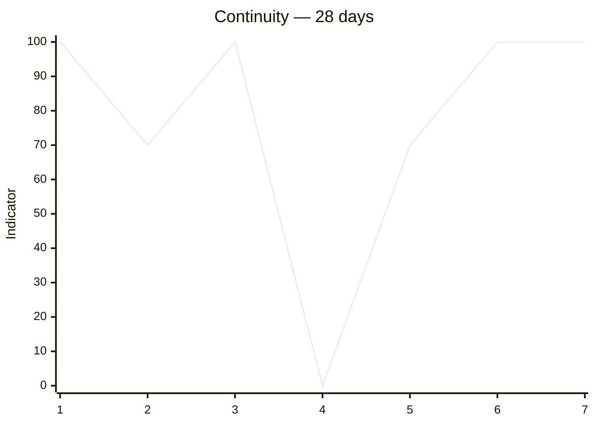
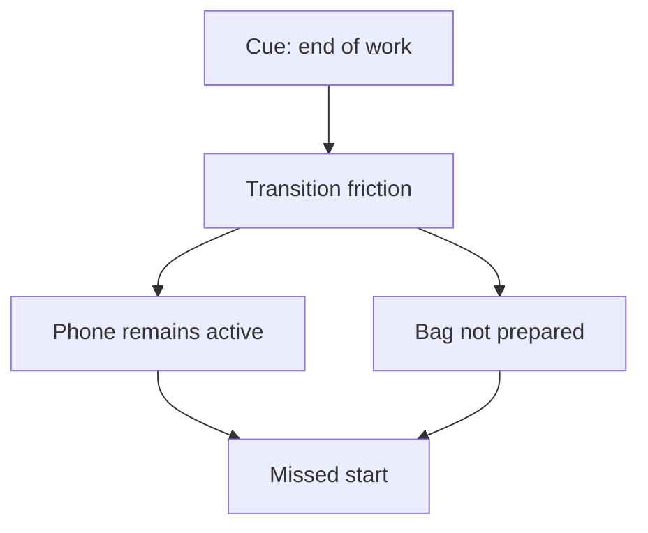
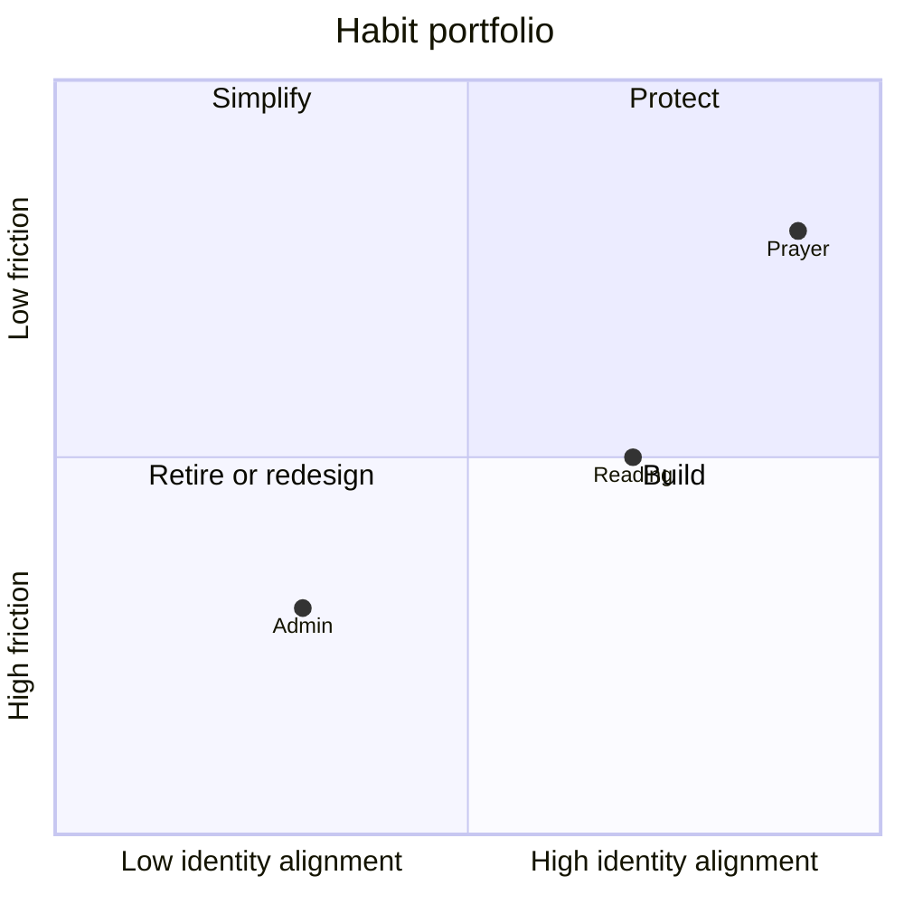
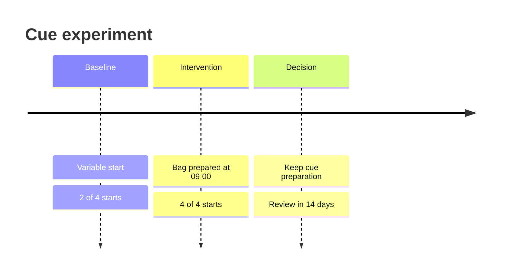

# Analytics and Visual Language

## Contents

1. Analytics principles
2. Evidence windows
3. Core metrics
4. Unwanted-habit metrics
5. Load and recovery metrics
6. Pattern detection
7. Adaptation rules
8. Visualization selector
9. Mermaid templates
10. Reporting language

## 1. Analytics principles

- Every metric includes a local-date window and denominator.
- Separate `unknown` from `missed`.
- Separate target, minimum, and partial outcomes.
- Exclude `excused` opportunities from the denominator unless the contract says otherwise.
- Do not compare habits with materially different frequency or difficulty using a single raw count.
- Do not infer causality from a chart.
- State whether data is explicit, observed, inferred, or missing.
- Prefer moving windows and recovery measures over lifetime averages.
- Keep streaks secondary because they over-penalize a single disruption and can encourage dishonesty.

## 2. Evidence windows

Default windows:

| View | Window | Minimum useful evidence |
| --- | --- | --- |
| Immediate check-in | current opportunity | one explicit event |
| Micro trend | 7 local days | 3 scheduled opportunities |
| Habit pulse | 28 local days | 8 opportunities |
| Monthly review | calendar month | state completeness |
| Formation/automaticity | 8–12+ weeks | repeated stable cue plus self-rating |

If evidence is below threshold, label the result `early signal`, not `pattern`.

## 3. Core metrics

Let `N` be eligible scheduled opportunities in the window.

Outcome weights for an operational continuity indicator:

| Outcome | Weight |
| --- | ---: |
| `done` | 1.00 |
| `minimum` | 0.70 |
| `partial` | 0.40 |
| `missed` | 0.00 |
| `blocked` | 0.00, reported separately |
| `excused` | excluded |
| `unknown` | excluded from scored numerator and reported as missing |

### Target completion rate

\[
TCR = \frac{\#done}{N}
\]

### Minimum-or-better rate

\[
MBR = \frac{\#done + \#minimum}{N}
\]

### Continuity indicator

\[
CI = \frac{1.0\#done + 0.7\#minimum + 0.4\#partial}{N}
\]

Call `CI` an operational indicator, not a validated psychological score.

### Data completeness

\[
DC = \frac{\#opportunities\ with\ explicit/observed\ outcomes}{\#eligible\ opportunities}
\]

Never interpret low adherence when completeness is low without stating the uncertainty.

### Recovery latency

For every `missed` or `lapse`, calculate local days or subsequent eligible opportunities until the next successful response. Report median and range when at least two recoveries exist.

### Rescue rate

For build/maintain habits:

\[
RR = \frac{\#minimum\ after\ a\ documented\ disruption}{\#documented\ disrupted\ opportunities}
\]

For reduce/stop habits, use replacement rescue rate:

\[
RR_r = \frac{\#substituted + \#interrupted}{\#urge + \#lapse\ opportunities}
\]

Avoid double-counting multiple logs from one opportunity.

### Automaticity pulse

Ask occasionally, not daily:

1. “The action started automatically when the cue occurred.”
2. “Starting required little conscious negotiation.”

Rate each 1–7 and average only within the same habit/cue contract. Label as self-report.

## 4. Unwanted-habit metrics

Use opportunity-level denominators where possible.

| Metric | Formula | Interpretation limit |
| --- | --- | --- |
| Abstinence opportunity rate | `(abstained + resisted + substituted) / relevant opportunities` | requires reliable exposure definition |
| Urge response success | `(resisted + substituted + interrupted) / urges with known outcome` | interrupted is reported separately too |
| Lapse frequency | `lapses / relevant opportunities` | not moral worth; severity may differ |
| Interruption rate | `interrupted / lapses started` | requires explicit start/stop evidence |
| Replacement adoption | `substituted / urges with known response` | replacement quality is not assumed |
| Recovery latency | opportunities until next abstained/resisted/substituted outcome | acute safety can supersede analytics |

Do not report “no exposure” as proof of self-control. It may reflect environment, not response capacity.

## 5. Load and recovery metrics

### Active demanding habits

Count habits in active change rather than stable maintenance. Default warning threshold is more than three demanding builds/reductions simultaneously; this is a design heuristic, not a universal clinical limit.

### Today load

Estimate from:

- planned duration;
- perceived difficulty;
- transition cost;
- current energy/recovery;
- number of distinct contexts;
- overlap/conflict with fixed obligations.

Do not hide the components in a single score. If the user is in `recover`, cap primary Today Flow below the ordinary seven-item maximum.

### Recovery health

Track:

- sleep-related barriers if voluntarily reported;
- days in recovery season;
- minimum-version use;
- paused nonessential habits;
- subjective capacity trend.

Do not infer medical recovery from adherence.

## 6. Pattern detection

### Evidence ladder

- `observation`: one event;
- `early signal`: 2 comparable events;
- `probable pattern`: 3+ comparable events with no strong counterevidence;
- `stable pattern`: 6+ comparable events across at least 2 weeks;
- `causal candidate`: repeated association suitable for an experiment;
- `supported within-person effect`: preregistered-style experiment with clear before/after or alternating evidence; still not universal causality.

### Barrier concentration

Calculate barrier share only when barrier coding completeness is adequate:

\[
BC_b = \frac{\#eligible\ failures\ coded\ as\ barrier\ b}{\#failures\ with\ known\ barrier}
\]

Say “4 of 5 coded frictions occurred after 17:00,” not “17:00 causes failure.”

### Association checks

Mood, energy, location, and day-of-week associations require:

- explicit/observed values;
- enough variation in both predictor and outcome;
- at least 6 comparable opportunities;
- an uncertainty warning;
- no medical interpretation.

## 7. Adaptation rules

| Evidence | Allowed action |
| --- | --- |
| One miss | record, protect next cue; no contract rewrite |
| Two similar frictions | mention early signal; collect discriminator |
| Three similar frictions | propose one 7–14 day experiment |
| Safety/feasibility issue | adapt immediately with rationale |
| Low completeness | simplify logging before optimizing behavior |
| Strong performance, low automaticity | preserve cue; avoid premature scaling |
| Strong performance, high automaticity | graduate to maintenance or cautiously scale |
| Repeated minimum only | decide whether minimum is the honest target or target needs redesign |

## 8. Visualization selector

| Question | Best visual | Skip when |
| --- | --- | --- |
| “How has adherence changed?” | Mermaid `xychart-beta` | fewer than 7 days |
| “Where does the system break?” | Top-down flowchart | only one barrier |
| “What changed this month?” | Timeline | fewer than 3 meaningful events |
| “How do habits support goals?” | Growth Graph flowchart | only one habit-goal pair |
| “Which outcomes dominate?” | Exact table; pie only for a single clean denominator | missingness is high |
| “What is today?” | Ranked list/table | always; diagram rarely helps |
| “How did an urge unfold?” | State diagram | a short sentence is clearer |

Charts must include window, unit, and missingness in accompanying prose. Avoid decorative diagrams.

## 9. Mermaid templates

### 28-day continuity trend

Use daily weighted values `0–100`. Do not interpolate unknown dates; use `0` only for confirmed missed opportunities and explain non-due dates.

### Barrier map

### Habit portfolio

Use quadrant values only when they come from explicit ratings or a clearly disclosed operational rubric.

### Experiment timeline

## 10. Reporting language

Use calibrated phrases:

- “Les données montrent…” for direct counts.
- “Signal précoce…” for two comparable events.
- “Pattern probable…” for three or more with caveat.
- “Hypothèse à tester…” for causal candidates.
- “Impossible à conclure…” when completeness or denominator is inadequate.

Never say:

- “Ton cerveau est reprogrammé.”
- “Cette habitude est installée pour toujours.”
- “Tu manques de discipline” based on misses.
- “Le graphique prouve que X cause Y.”
- “66 jours et ce sera automatique.”

