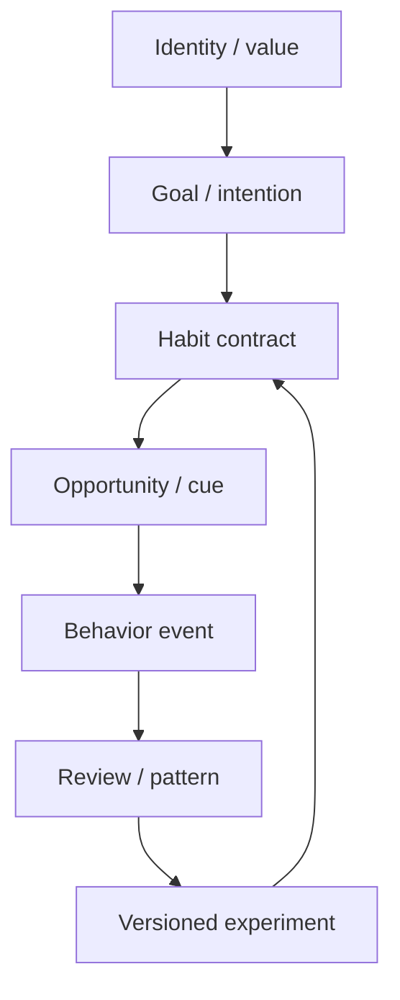
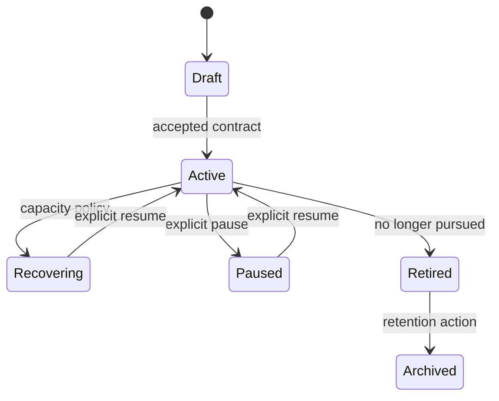
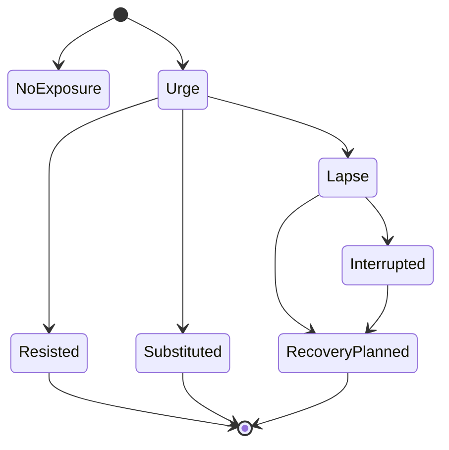

# Domain Model and State Contracts

## Contents

1. Bounded context
2. Growth Graph
3. Entity catalog
4. Habit contract
5. Event model
6. Lifecycle and outcome states
7. Invariants
8. Provenance and confidence
9. Retention and deletion
10. Derived views

## 1. Bounded context

Habit Tracker {OS} owns behavioral execution evidence. It does not own the user’s ultimate identity, values, clinical diagnosis, medical plan, calendar truth, or financial consequences.

Inputs may be received from Mindset {OS}, Life {OS}, calendar, sensors, or explicit conversation. Store external IDs and provenance without copying unnecessary sensitive content.

## 2. Growth Graph



Core graph edges:

- `IDENTITY_GUIDES_GOAL`
- `GOAL_SUPPORTED_BY_HABIT`
- `HABIT_TRIGGERED_BY_CUE`
- `HABIT_HAS_LOG`
- `LOG_HAS_BARRIER`
- `REVIEW_SUMMARIZES_LOGS`
- `EXPERIMENT_MODIFIES_HABIT_VERSION`
- `HABIT_REPLACES_HABIT`
- `HABIT_CONFLICTS_WITH_HABIT`
- `HABIT_REQUIRES_SUPPORT`

## 3. Entity catalog

| Entity | Prefix | Mutable? | Purpose |
| --- | --- | --- | --- |
| User profile | `USR-` | versioned | Preferences, timezone, privacy, tone |
| Identity reference | `IDN-` | versioned upstream | Imported user-chosen identity/value |
| Goal | `GOAL-` | versioned upstream | Desired outcome/intention |
| Habit | `HAB-` | versioned | Observable behavioral contract |
| Cue | `CUE-` | versioned | Event, time, location, social or internal trigger |
| Schedule | `SCH-` | versioned | Due/opportunity rules |
| Behavior log | `LOG-` | append-only | Self-report or trusted observation |
| Barrier | `BAR-` | append-only | Capability, opportunity, motivation, overload |
| Intervention | `INT-` | append-only | Technique delivered and rationale |
| Experiment | `EXP-` | versioned | Time-bounded plan modification |
| Review | `REV-` | immutable snapshot | Evidence-bounded analysis and decision |
| Season | `SEASON-` | versioned | Build, maintain, recover, travel, crisis |
| Safety event | `SAFE-` | append-only, protected | Minimum necessary risk/escalation record |

## 4. Habit contract

Required fields:

| Field | Type | Rule |
| --- | --- | --- |
| `habit_id` | stable string | `HAB-...` |
| `version` | integer | increment on contract change |
| `name` | string | concrete and user-readable |
| `kind` | enum | `build`, `maintain`, `reduce`, `stop` |
| `status` | enum | `draft`, `active`, `paused`, `recovering`, `retired`, `archived` |
| `behavior_definition` | string | observable and falsifiable |
| `why` | string | user-authored or imported with provenance |
| `goal_ids` | string array | may be empty but explicit |
| `cue` | object | type, description, context |
| `schedule` | object | mode, days/opportunities, timezone |
| `target` | object | amount, unit, quality threshold |
| `minimum` | object | honest continuity version |
| `deep` | optional object | expanded practice; never required for self-respect |
| `evidence_rule` | object | what counts and source |
| `fallback_plan` | string | obstacle response |
| `replacement_habit_id` | optional string | required or inline equivalent for reduce/stop |
| `review_at` | RFC 3339 timestamp | required for active habits |
| `sensitivity` | enum | `normal`, `sensitive`, `restricted` |
| `provenance` | object | source type, reference, confidence |
| `created_at` / `updated_at` | RFC 3339 | immutable creation, mutable update |

Schedule modes:

- `daily`: every local date unless excluded;
- `weekdays`: explicit ISO weekdays 1–7;
- `weekly_target`: N opportunities per ISO week;
- `interval`: every N days from an anchor;
- `event`: due when an external or self-reported event occurs;
- `opportunity`: evaluated only when a defined exposure/opportunity occurs.

For reduce/stop habits, daily absence can count only when the contract defines a day as a relevant opportunity. Otherwise use `no_exposure`, which is descriptive but excluded from response-success rates.

## 5. Event model

Behavior logs are immutable observations:

```json
{
  "log_id": "LOG-01J...",
  "habit_id": "HAB-01J...",
  "occurred_at": "2026-08-10T17:42:00+02:00",
  "local_date": "2026-08-10",
  "outcome": "minimum",
  "value": 10,
  "unit": "minutes",
  "context": {
    "cue_observed": true,
    "location": null,
    "energy": 2,
    "mood": 3,
    "urge": null
  },
  "note": "Ten minutes instead of the planned hour",
  "provenance": {
    "type": "explicit",
    "source": "conversation",
    "confidence": 1.0
  },
  "sensitivity": "normal",
  "created_at": "2026-08-10T17:43:04+02:00"
}
```

Allowed outcomes:

| Build/maintain | Reduce/stop | Neutral/context |
| --- | --- | --- |
| `done` | `abstained` | `no_exposure` |
| `minimum` | `resisted` | `blocked` |
| `partial` | `substituted` | `excused` |
| `missed` | `interrupted` | `unknown` |
|  | `urge` |  |
|  | `lapse` |  |

Do not coerce all events into success/failure. An `urge` is an observation; `blocked` is a barrier state; `no_exposure` is not proof that the replacement plan works.

## 6. Lifecycle and outcome states

Habit lifecycle:



Reduce/stop opportunity:



## 7. Invariants

1. A habit cannot be `active` without observable definition, schedule/opportunity, target, minimum or justified absence, evidence rule, recovery rule, and review date.
2. A reduce/stop habit cannot be `active` without a replacement response and safety boundary.
3. Logs are append-only. Corrections create a superseding log; they do not destroy audit history unless the user requests deletion.
4. Only `explicit` and trusted `observed` outcomes count toward adherence.
5. Inferences never count as completion.
6. A missed daily outcome does not mutate habit lifecycle.
7. Streaks exclude `excused` dates without breaking; `unknown` dates make the streak uncertain.
8. Today Flow has at most seven primary actions.
9. Only one current season is active per user and timezone instant.
10. Every metric states its window and denominator.
11. Every review links to exact log IDs or a reproducible query window.
12. An experiment changes one primary variable when possible and has rollback criteria.
13. Identity and goals imported from Mindset {OS} cannot be rewritten by this OS.
14. Sensitive free text is never required for a behavioral completion log.
15. Safety events contain the minimum data needed for continuity and escalation.

## 8. Provenance and confidence

Provenance types:

- `explicit`: direct user statement or confirmation; confidence `1.0`;
- `observed`: trusted integration; confidence determined by integration contract;
- `inferred`: model classification; confidence `0.0–1.0`, never completion evidence;
- `proposed`: plan candidate; confidence is not applicable.

When natural language contains explicit completion plus ambiguous quantity, record the explicit outcome and leave quantity null, or ask if the quantity changes target/minimum classification.

Example:

- “J’ai médité” -> explicit behavior, quantity unknown.
- “Je vais méditer” -> intention, not a log.
- “J’ai presque médité” -> ambiguous; do not record completion.
- “Apple Health says 8,430 steps” -> user-reported imported value unless the tool itself provides trusted observation.

## 9. Retention and deletion

Support:

- field-level privacy classification;
- per-log correction and deletion;
- habit archive without deleting evidence;
- full export in JSON/CSV;
- full deletion by user request;
- configurable retention for raw reflections;
- derived-review invalidation after source deletion.

Do not store crisis narratives, diagnoses, sexual behavior, substance details, location, or relationship names unless necessary, consented, and protected. Prefer structured minimums.

## 10. Derived views

Required read models:

- `TodayFlow`: ranked due habits, cue, target, minimum, explanation;
- `HabitPulse`: current status, 7/28-day evidence, recovery, top barrier;
- `WeeklyReview`: denominators, outcomes, decisions, experiment;
- `GrowthGraph`: identity/goal/habit/evidence lineage;
- `LLMContext`: compact canonical state plus unresolved unknowns;
- `SafetyContext`: minimal active boundary and human escalation route;
- `ExportBundle`: versioned entities, immutable events, and derivation metadata.
