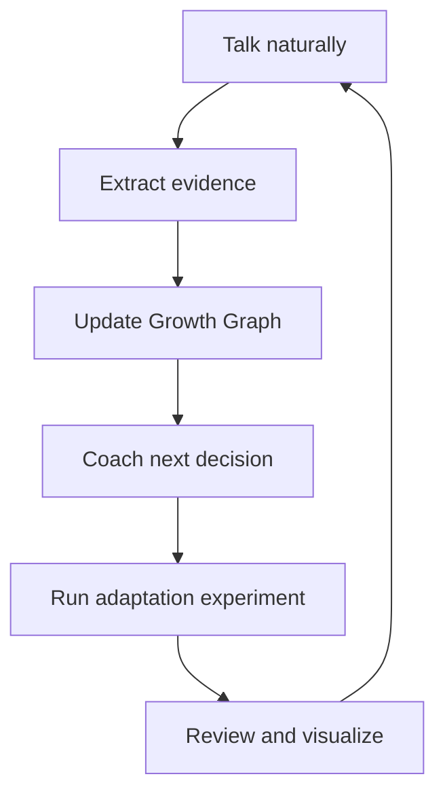

# Feature Catalog and Product Surface

## Contents

1. Product thesis
2. Conversational interface
3. Onboarding and personal contract
4. Good-habit engine
5. Unwanted-habit engine
6. Motivation and reflection
7. Stoic practice layer
8. Adaptive intelligence
9. Memory and knowledge
10. Reviews, analytics, and visuals
11. Accountability and social support
12. Integrations
13. Privacy and safety
14. Creator/admin capabilities
15. Deployment modes
16. Recommended releases

## 1. Product thesis

The product is not a dashboard with a chatbot attached. The chat is the operating surface, and the state engine is the invisible spine.

Core loop:

The OS should feel like a calm, intelligent chief-of-staff for behavior: fast for logging, deep when reflection is valuable, and silent when no intervention is needed.

## 2. Conversational interface

### Natural-language operations

- create, edit, pause, resume, retire, archive, export, and delete habits;
- log one or many behaviors in one message;
- correct dates, quantities, and outcomes conversationally;
- accept voice notes and transcribe before typed confirmation;
- understand references such as “fait,” “celle de ce matin,” or “comme hier” only when context is unambiguous;
- distinguish future intention from past evidence;
- handle French, English, and mixed-language input;
- show a compact write receipt after every persistent change;
- expose “what did you understand?” and “what do you remember?” commands;
- permit `minimal`, `gentle`, `direct`, `stoic`, and `strategic` response modes;
- offer silence/observer mode where the system records but does not coach every event.

### Suggested command aliases

| Command | Natural-language equivalent |
| --- | --- |
| `/habit setup` | “Construis mon système d’habitudes à partir de Mindset OS.” |
| `/habit today` | “Quelles habitudes comptent aujourd’hui ?” |
| `/habit done` | “Sport fait, 45 min.” |
| `/habit urge` | “Envie de fumer 8/10 maintenant.” |
| `/habit reset` | “J’ai décroché; aide-moi à reprendre.” |
| `/habit review` | “Bilan de ma semaine.” |
| `/habit adapt` | “Le plan est trop lourd; change-le.” |
| `/habit stoic` | “Fais ma revue stoïcienne du soir.” |
| `/habit graph` | “Montre l’évolution et les blocages.” |
| `/habit memory` | “Qu’est-ce que tu mémorises ?” |
| `/habit export` | “Exporte toutes mes données.” |

Commands are shortcuts, never required syntax.

## 3. Onboarding and personal contract

- import identity, why, values, roles, goals, anti-goals, constraints, and evidence labels from Mindset {OS};
- select build/maintain/recover/travel season;
- inventory good, neutral, and unwanted patterns;
- classify habits as keep/build/reduce/stop/pause/observe;
- select one keystone habit and at most three demanding changes;
- define floor/minimum, standard/target, and optional deep versions;
- set cue, context, opportunity, evidence, fallback, and review date;
- configure coaching tone and reflection depth;
- configure maximum prompts, quiet hours, cooldowns, and notification pressure;
- configure forbidden topics and non-retained fields;
- configure trusted human/professional support where chosen;
- establish baseline through immediate start or short observation phase;
- run a pre-mortem and create a `Not Now` habit backlog.

## 4. Good-habit engine

- cue-linked behavior contracts;
- time, event, location, social, internal, and opportunity triggers;
- daily, weekday, weekly-target, interval, event, and opportunity schedules;
- honest target/minimum/deep outcomes;
- two-minute launch action;
- task setup and environment preparation;
- implementation-intention and obstacle clauses;
- routine containers with ordered steps and interruption rules;
- portable/travel versions;
- energy-aware minimum suggestions;
- gradual scaling after stability;
- graduation from active build to maintenance;
- maintenance decay detection;
- skill/checklist/project routing when a habit is the wrong abstraction;
- completion evidence from explicit report or trusted observation;
- optional device-data reconciliation without treating sensors as motives.

## 5. Unwanted-habit engine

- trigger → emotion/body → story → urge → action → payoff → cost map;
- urge intensity and duration tracking;
- live `U-R-G-E` intervention;
- preselected replacement response;
- friction, delay, location exit, blocker, and support strategies;
- `abstained`, `resisted`, `substituted`, `interrupted`, `lapse`, and `no_exposure` outcomes;
- lapse debrief without streak catastrophe;
- next-safe-opportunity recovery;
- high-risk context detection;
- response success separated from absence of exposure;
- reduction targets distinct from zero-target stop contracts;
- professional-plan mode for dependence, eating-disorder recovery, medication, or clinical care;
- escalating human support without agent dependency.

## 6. Motivation and reflection

- motivational-interviewing stance for ambivalence;
- change-talk reflection;
- user-authored why and anti-why;
- autonomy, competence, and human relatedness checks;
- identity evidence ledger;
- promise kept/repaired/avoided distinctions;
- compassionate accountability;
- direct contradiction challenge when evidence and declared intention diverge;
- values-based tradeoff review;
- “what would make this easier?” diagnostic;
- future-self and process visualization, clearly separated from magical guarantees;
- WOOP/mental contrasting;
- prayer or spiritual anchoring when user-led;
- celebration calibrated to behavior, not flattery;
- reward audit to prevent external rewards from replacing meaning;
- readiness and confidence rulers;
- narrative summary that quotes no hidden reasoning and distinguishes fact from interpretation.

## 7. Stoic practice layer

- morning control map;
- premeditation of plausible obstacles;
- impression vs fact check;
- control/influence/acceptance classification;
- virtue-based action selection: wisdom, courage, justice, temperance;
- voluntary discomfort only when safe and user-chosen;
- obstacle-to-training reframe without denying constraints;
- evening review: action, judgment, repair, gratitude, next duty;
- view-from-above for perspective, not dissociation;
- memento mori as values clarity, never fear or frantic productivity;
- short classical-source mode or plain-language mode;
- spirituality compatibility without treating Stoicism as a religion or clinical treatment.

## 8. Adaptive intelligence

- COM-B barrier classifier;
- uncertainty-aware intervention selector;
- one discriminating question instead of generic advice;
- just-in-time prompt policy with cooldown;
- active habit load governor;
- season-aware ranking;
- recovery mode with no catch-up debt;
- single-variable experiments;
- experiment hypothesis, duration, signal, stop, and rollback;
- personalization learned only from explicit preference or sufficient repeated evidence;
- counterevidence search before pattern claims;
- intervention fatigue detection;
- message-length adaptation;
- scheduled-review depth based on data completeness;
- model confidence and provenance tracking;
- tool failure honesty and idempotent retries;
- escalation from self-help to selected human support.

### Optional advanced intelligence

- within-person causal experiments using alternating or stepped schedules;
- contextual bandit for low-risk prompt timing after sufficient consented data;
- semantic clustering of barriers with user-verifiable labels;
- counterfactual prompts: “what changed on successful comparable days?”;
- relapse-risk forecast only as a calibrated warning, never certainty;
- anomaly detection for sudden broad behavior change, routed through safety rather than diagnosis;
- retrieval of prior successful recovery scripts;
- federated/on-device personalization for privacy-sensitive deployments.

Do not activate experimental inference methods without transparent evaluation and user control.

## 9. Memory and knowledge

- stable user preferences;
- external identity/goal references;
- versioned habit contracts;
- append-only behavior events;
- barrier and intervention records;
- experiments and outcomes;
- evidence-bounded review snapshots;
- working-memory expiry;
- per-field provenance and confidence;
- inspect/correct/delete/export operations;
- sensitive-note minimization;
- memory conflict detection;
- source deletion cascading to derived-review invalidation;
- token-bounded context assembly;
- long-term compression without losing source links.

## 10. Reviews, analytics, and visuals

### Daily

- Today Flow with at most seven primary items;
- completion receipts;
- unresolved data check;
- optional one-line evening reflection.

### Weekly

- scheduled opportunities and completeness;
- target/minimum/partial separation;
- recovery latency and rescue rate;
- top barrier with evidence count;
- keep/change/stop decisions;
- one next experiment;
- one visual only when useful.

### Monthly/quarterly

- identity and goal alignment;
- habits graduated, paused, or retired;
- active load and costs;
- environment and season changes;
- what evidence challenges the original belief;
- Mindset {OS} reflection packet.

### Visual library

- Mermaid XY trend on known opportunities;
- heatmap artifact for exact daily state when a richer UI/file is available;
- Growth Graph: identity → goal → habit → evidence;
- barrier flowchart;
- unwanted-habit state diagram;
- experiment timeline;
- habit portfolio quadrant using explicit ratings;
- Sankey only when several clear transitions exist;
- tables for exact outcome mappings and sparse data;
- natural-language “story of change” beside every quantitative visual.

## 11. Accountability and social support

- private accountability partner;
- coach/clinician plan-following mode;
- body-doubling request;
- group/circle check-in with explicit sharing scope;
- promise/done/evidence/friction/repair/next format;
- missed-check-in follow-up with cooldown;
- consented escalation after repeated silence;
- no public shame or hidden disclosure;
- bounded commitment contracts;
- optional financial stake only after ethical guardrails;
- support-network map and emergency contact reference;
- celebrate repair as well as perfect completion.

## 12. Integrations

- Mindset {OS}: identity, why, values, philosophy, 90-day goals;
- Life {OS}: current season, Today Flow, promises, recovery;
- Calendar: scheduled cues and time conflicts;
- Apple Health/Google Health Connect: observed activity/sleep data with source labeling;
- wearables: optional observations, never automatic motive inference;
- reminders/automations: due prompts, reviews, condition-triggered check-ins;
- voice capture and transcription;
- location categories with coarse/privacy-preserving defaults;
- notes/journal import as untrusted data;
- clinician/coach plan import with explicit boundaries;
- Notion or data warehouse export;
- Convex/realtime backend production adapter;
- provider-agnostic LLM gateway;
- evaluation and observability pipeline.

## 13. Privacy and safety

- local-first SQLite deployment;
- encrypted hosted deployment where implemented;
- role- and field-level access;
- restricted sensitive events;
- minimal retention and user-selected expiry;
- full export/delete;
- human-readable memory inspection;
- separate consent for passive sensing;
- no sale of sensitive habit data;
- prompt-injection isolation for imported text;
- medical, addiction, eating, exercise, sleep, self-harm, mania, psychosis, and dependency guardrails;
- safety event takes precedence over performance;
- verified local crisis information when escalation is needed;
- audit logs for external writes and sharing.

## 14. Creator/admin capabilities

- versioned system prompt and policy registry;
- technique library mapped to evidence source and risk tier;
- experiment template editor;
- coaching tone configuration;
- localization and cultural review;
- red-team dataset;
- parsing accuracy dashboard;
- safety false-positive/false-negative review;
- intervention effectiveness by habit/context, without overclaiming causality;
- prompt/model version logging;
- rollback and feature flags;
- schema migrations;
- retention-policy administration;
- source and evidence registry;
- user feedback linked to process vs knowledge failures.

## 15. Deployment modes

| Mode | Primary experience | State | Best for |
| --- | --- | --- | --- |
| ChatGPT skill | direct conversation | skill + connected memory/tools | personal use and rapid iteration |
| Local private | CLI plus any LLM | SQLite | sensitive/private experimentation |
| Mobile chat | iOS-first conversation, voice, optional chips | Convex/offline queue | premium daily companion |
| Web/desktop | chat plus deep reviews | durable backend | coaches, founders, power users |
| Omega module | routed agent in a larger personal OS | shared governed graph | Mindset/Life/Calendar orchestration |
| Coach/circle | consented multi-user accountability | tenant-isolated backend | groups and professional programs |

The state and event contracts remain identical across modes.

## 16. Recommended releases

### V1 — Conversation core

- natural-language setup and logging;
- good/reduce habit contracts;
- Today Flow;
- check-in, urge, lapse, and weekly review;
- SQLite engine;
- exact metrics and Mermaid trend;
- Mindset handoff;
- safety, export, deletion, and eval suite.

### V1.5 — Adaptive coach

- barrier classifier;
- versioned experiments;
- voice input;
- quiet hours and cooldowns;
- recovery/travel seasons;
- richer visuals;
- human accountability with consent.

### V2 — Contextual OS

- calendar and trusted device observations;
- mobile/offline experience;
- provider/model evaluation router;
- contextual intervention timing;
- cross-domain Life {OS} coordination;
- coach/circle modes.

### V3 — Learning system

- privacy-preserving within-person experimentation;
- user-controlled prediction and anomaly signals;
- robust longitudinal causal analysis;
- federated/on-device personalization;
- independently evaluated high-risk-domain modules.

Do not ship advanced prediction before core evidence integrity, safety, correction, export, and deletion are proven.

