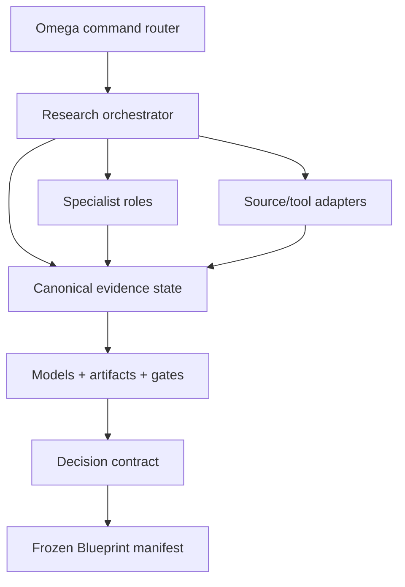

# Market Research {OS} — Omega OS Integration

## Contents

1. Installation model
2. Runtime components
3. Command routing
4. Agent graph
5. Persistence
6. Tool registration
7. Prompt assembly
8. External actions and approvals
9. Blueprint handoff
10. Verification
11. Deployment profiles

## 1. Installation model

Install Market Research {OS} as a bounded research compiler, not one giant prompt.



Equivalent layers:

1. System layer — master operating prompt and boundary.
2. Skill layer — workflow and progressive references.
3. Function layer — deterministic state, IDs, sources, trace, models, gates, checkpoints, exports.
4. Acquisition layer — authorized API, file, SQL, browser, crawler, survey, and experiment adapters.
5. Persistence layer — versioned canonical evidence and artifacts.
6. Handoff layer — signed/frozen decision and Blueprint input.

Preview then apply:

```bash
python3 scripts/install_omega_os.py /absolute/path/to/omega-os
python3 scripts/install_omega_os.py /absolute/path/to/omega-os --apply
```

The installer preserves differing existing files unless `--force` is explicitly used after reviewing the dry run.

## 2. Runtime components

Omega OS should provide:

- command router;
- prompt assembler with trusted instructions separated from untrusted evidence;
- sequential and optional fan-out/fan-in orchestration;
- project/run scoped state store and append-only journal;
- stable ID allocator and optimistic concurrency;
- source registry, artifact store, query/run ledger, trace graph;
- connector registry for official APIs, internal data, files, browser/search, and approved crawlers;
- secret manager references and least-privilege permissions;
- external-action approval/consent/spend gates;
- notebook/spreadsheet/model execution surface;
- validation/gate/critic engine;
- checkpoint/resume/version/delta;
- exports and Blueprint handoff;
- observability for source/tool/model/cost/latency/coverage/errors/gates.

Recommended paths:

```text
omega-os/
  skills/market-research-os/SKILL.md
  prompts/market-research-os/system.md
  prompts/market-research-os/roles/*.md
  tools/market-research-os/definitions.json
  schemas/market-research-os/state.schema.json
  schemas/market-research-os/blueprint-handoff.schema.json
  config/market-research-os.manifest.json
  state/projects/<project-id>/market-research/
    state.json
    journal.ndjson
    checkpoints/
    source-snapshots/
    queries/
    experiments/
  artifacts/projects/<project-id>/market-research/
    exports/
    models/
    handoffs/
```

Adapt paths, but keep one authoritative writable state. Analytics/search/graph views are projections, not competing truth.

## 3. Command routing

| Command | Mode | Behavior |
| --- | --- | --- |
| `/market-research <idea>` | infer/NEW | Full decision framing and selected depth |
| `/market-research scan <idea>` | RAPID_SCAN/SIGNAL | Directional scan and validation plan |
| `/market-research validate <idea>` | FULL_VALIDATION/VALIDATION | Full research and staged validation |
| `/market-research diligence <opportunity>` | DILIGENCE/INVESTMENT_GRADE | Stronger source/method/model/governance standards |
| `/market-research recover <project>` | RECOVER | Restore canonical evidence baseline |
| `/market-research deep <scope>` | DEEP_DIVE | Bounded market/segment/competitor/price/channel question |
| `/market-research monitor` | MONITOR | Run approved refresh queries and deltas |
| `/market-research audit` | AUDIT | Source/method/model/bias/trace/gate audit |
| `/market-research delta <a> <b>` | DELTA | Semantic evidence/confidence/decision change |
| `/market-research continue` | resume | Resume exact continuation pointer |
| `/market-research status` | read | Progress, sources, hypotheses, blockers, gates, cost |
| `/market-research source add` | mutate | Register authorized source/preflight |
| `/market-research experiment` | design | Create experiment contract; execution needs authority |
| `/market-research score` | read | Hypothesis/gate/opportunity diagnostic |
| `/market-research export <view>` | read | Render requested artifact/view |
| `/market-research handoff` | gated | Freeze Blueprint manifest if eligible |

Aliases may include `/research` or `/market`, but avoid collisions. Bind `/blueprint` exclusively to Blueprint {OS}; Market Research only creates a manifest.

## 4. Agent graph

Implement specialist roles from `orchestration-and-gates.md`. Each node receives:

```json
{
  "project_id": "...",
  "run_id": "...",
  "baseline_revision": 12,
  "decision_scope": {},
  "read_sets": [],
  "write_sets": [],
  "source_permissions": [],
  "external_action_authority": "none",
  "cost_budget": {},
  "must_emit": ["records", "sources", "methods", "limitations", "negative_evidence", "trace_links", "findings"],
  "output_mode": "patch"
}
```

Chief Editor validates baseline, schema, permissions, source preflight, write set, IDs, evidence type, trace, and costs. It merges non-conflicts and registers conflicts. Specialists cannot accept decisions or override kill gates.

## 5. Persistence

Minimum `state.json` contains:

- run/project/version/status/depth;
- decision brief and authority;
- sources/preflights/query runs;
- epistemic ledgers;
- questions/hypotheses;
- methods/samples/studies/experiments;
- markets/segments/JTBD/alternatives/signals;
- estimates/models/scenarios/pricing/economics/channels;
- risks/mitigations/critics;
- trace links/gates/recommendations/handoffs;
- continuation and ID counters;
- revision/checksum/timestamps.

The journal is append-only. Source snapshots must follow rights/retention policy. Frozen handoffs are immutable. Material evidence changes invalidate affected models/gates/recommendation until recomputed.

Concurrency:

- optimistic revision check;
- central ID allocation;
- idempotency key per tool/run;
- locks for model/source/experiment write sets where necessary;
- stale patch rejection/rebase;
- one canonical commit per merge.

## 6. Tool registration

Load `assets/market-research-tools.json`. Handlers should return:

```ts
type ResearchToolContext = {
  actorId: string;
  projectId: string;
  runId: string;
  permissions: string[];
  sourcePreflightIds: string[];
  externalActionAuthority: "none" | "research-only" | "approved-scope";
  costBudget: { currency: string; remaining: number };
  traceId: string;
};

type ResearchToolResult<T> = {
  ok: boolean;
  revision: number;
  data?: T;
  findings?: ResearchFinding[];
  coverage?: { requested: number; received: number; failed: number };
  cost?: { amount: number; currency: string };
  error?: { code: string; message: string; retryable: boolean };
};
```

Require idempotency, typed inputs/outputs/errors, allowlists, size/rate/cost caps, secret references, source preflight, provenance, and audit. Never expose general filesystem/network/database access through unconstrained model arguments.

## 7. Prompt assembly

Order:

1. Omega safety/system policy;
2. Market Research master system prompt;
3. current user/project authority and decision;
4. relevant skill workflow/reference;
5. canonical state slice and hard constraints;
6. source/preflight/tool permissions;
7. authorized source excerpts labeled untrusted;
8. node task/write set/output schema/budget.

Always include decision scope, current accepted decisions, definitions, critical hypotheses, kill gates, conflicts, permissions, and relevant source IDs. Retrieve only reachable records. Do not concatenate all raw scraped content or expose secrets.

## 8. External actions and approvals

Model autonomy tiers:

- `A0 READ/DESIGN`: read authorized sources and design studies.
- `A1 BOUNDED COLLECTION`: execute preflight-approved API/crawl/query within caps.
- `A2 PARTICIPANT/CLIENT CONTACT`: explicit message/recruitment authorization and recipient review.
- `A3 PUBLISH/SPEND/TRACK`: explicit campaign, audience, claim, spend, privacy, platform approval.
- `A4 CONTRACT/PAYMENT/PRODUCTION CHANGE`: human confirmation and appropriate legal/financial/product authority.

Never escalate tiers implicitly. A user request for a research report is A0, not permission to scrape every platform or launch ads.

## 9. Blueprint handoff

Blueprint consumes a frozen research version, not a moving latest pointer.

Eligibility:

- recommendation is `GO` or a supported `PIVOT`;
- decision owner accepted the bounded scope;
- no critical gate fails;
- critical evidence/conditions/unknowns are traceable;
- unsupported ideas are excluded;
- market claims have expiry/refresh triggers.

Use `assets/blueprint-input-manifest.schema.json`. The handoff includes supported segment/JTBD/problem/alternatives/promise/value events/table stakes/anti-features/pricing/channel/constraints/risks/unknowns/mandatory validations/sources and checksum.

Research updates create a new handoff and impact notice. Blueprint must preserve research assumptions and uncertainty; it cannot convert them into decisions silently.

## 10. Verification

Before production routing, verify:

1. `/market-research` never invokes Blueprint/Stepper/Build implicitly.
2. SIGNAL depth cannot produce a full validated-market claim.
3. `GO/PIVOT` without required behavioral evidence fails G17.
4. unpreflighted scraper/API execution is rejected.
5. protected/authenticated/CAPTCHA access cannot be bypassed.
6. credentials remain secret references.
7. source claims without locators/method are rejected.
8. duplicated/syndicated sources do not inflate independence.
9. seeded parser errors/missingness/duplicates are detected.
10. market model inputs/formulas/ranges/sensitivities recalculate.
11. arbitrary 1%-of-TAM SOM is rejected.
12. experiment cannot launch above current autonomy tier.
13. critic detects seeded motivated reasoning and negative evidence omission.
14. critical gate failure blocks completion/handoff.
15. continuation restores exact IDs/pointer/checksum.
16. frozen handoff changes require a new version.
17. confidential/PII/license-restricted raw data is excluded from unauthorized exports.
18. source deletion/expiry marks downstream findings stale.

Use `scripts/market_research_os.py demo`, `init`, `validate`, `status`, `score`, and `checkpoint`.

## 11. Deployment profiles

### Minimal solo

One agent with role-separated passes, local JSON state, web/manual sources, deterministic validator, Markdown/JSON exports. Suitable for SIGNAL or small validation; keep all boundaries and gates.

### Professional agency

Shared state, specialist DAG, source/tool adapters, SQL/notebook/spreadsheet models, recruitment/study ops, controlled scraping, merge editor, critics, trace graph, checkpoints, client views, cost/coverage observability.

### Enterprise/investment-grade

Add RBAC, secret manager, policy-as-code, data catalog/lineage, legal/privacy approvals, vendor contracts, participant platform, immutable audit, independent methods/model review, licensed data, reproducibility environment, retention/deletion automation, signed decisions/handoffs, and monitoring.
