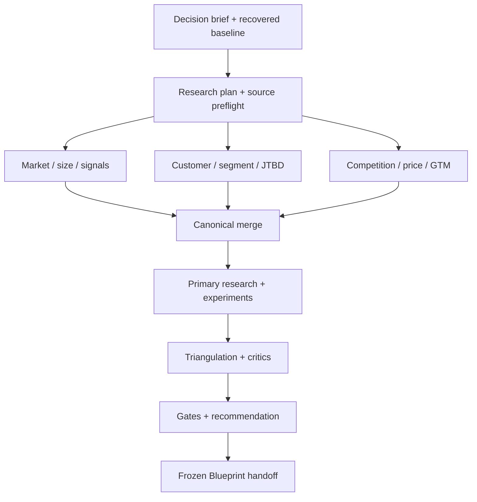

# Market Research {OS} — Orchestration and Quality Gates

## Contents

1. Shared-state architecture
2. Logical specialist roles
3. Execution graph
4. Node contract and merge protocol
5. Conflict and escalation rules
6. Critic passes
7. Gate definitions
8. Depth-specific completion
9. Readiness scoring

## 1. Shared-state architecture

All roles operate on one project-scoped canonical state. Specialist documents are not parallel truths.



Equivalent sequence: freeze the decision/research baseline; let bounded specialists analyze non-conflicting write sets; merge evidence and register conflicts; execute or specify primary validation; triangulate; run independent critics; evaluate gates; issue the recommendation; freeze the handoff.

Canonical state owns IDs, source records, hypotheses, evidence, model inputs, experiments, trace links, gates, decisions, and continuation. Specialists emit patches against a baseline revision.

## 2. Logical specialist roles

| Role | Primary write set | Cannot do |
| --- | --- | --- |
| Engagement Director | decision brief, scope, engagement risks | Invent customer facts. |
| Context Librarian | sources, recovered records, conflicts | Smooth over contradictory versions. |
| Research Architect | research questions, methods, samples, stopping rules | Claim results before execution. |
| Acquisition & Provenance Lead | source preflights, queries, lineage, coverage | Treat technical access as permission. |
| Market/Category Analyst | market boundary, PESTEL, forces, value chain, timing | Use frameworks as evidence. |
| Market-Sizing Modeler | estimates, formulas, inputs, sensitivity | Hide proxy assumptions or arbitrary SOM. |
| Customer/JTBD Researcher | segments, interviews, coded observations, jobs | Generalize beyond the sample silently. |
| Survey/Quant Methodologist | survey design, sampling, inference, uncertainty | Use convenience-sample percentages as population truth. |
| Competitive Intelligence Analyst | alternatives, competitors, pricing, value curves | Infer private metrics from weak proxies as fact. |
| Demand Signal Analyst | search/social/reviews/ads/jobs/filings/developer signals | Equate attention with revenue or demand. |
| Pricing/Economics Analyst | WTP, packaging, unit economics, scenarios | Present one method or point estimate as truth. |
| GTM Strategist | positioning/channel/funnel/partner evidence | Call a channel scalable without economics/access proof. |
| Experiment Designer | experiment contracts and analysis plans | Launch external action without approval. |
| Privacy/Ethics/Governance Reviewer | legal/ethical/data findings and controls | Provide legal certification or waive platform rules. |
| Data Quality Auditor | schema, freshness, duplicates, bias, reproducibility | Accept parser/model output without checks. |
| Red-Team Investment Critic | falsifiers, pre-mortem, negative cases | Make hidden scope decisions. |
| Traceability Auditor | links, orphans, unsupported extrapolations | Create meaningless links to raise coverage. |
| Chief Research Editor | merges, dispositions, gates, final recommendation proposal | Override authorized human decisions or hide uncertainty. |

Role prompts are in `assets/market-research-role-prompts.json`.

## 3. Execution graph

### Phase A — Frame and freeze

1. Initialize run and project namespace.
2. Recover authorized context and prior versions.
3. Create Decision Brief and Research Depth decision.
4. Register hypotheses and kill criteria.
5. Create Research Question Matrix and source/sample plan.
6. Complete acquisition preflight.
7. Freeze baseline revision.

### Phase B — Parallel secondary intelligence

Execute compatible lanes against the same baseline:

- category/macro/value chain/timing;
- market size and growth;
- segment/JTBD/buying system;
- voice-of-customer desk corpus;
- alternatives/competition;
- demand/trend signals;
- pricing/economics;
- GTM/channel;
- governance/data quality.

### Phase C — Canonical merge

1. Verify baseline revision and source IDs.
2. Schema-check every patch.
3. Reject writes outside declared write set.
4. Allocate IDs centrally.
5. Deduplicate sources and syndicated claims.
6. Detect definition, scope, time-window, and conclusion conflicts.
7. Merge non-conflicting records.
8. Register conflicts and missing source-of-truth items.
9. Update trace graph and hypothesis confidence.
10. Commit one canonical revision.

### Phase D — Primary validation

1. Prioritize evidence gaps by expected decision value.
2. Design/pretest instruments and experiments.
3. Obtain required authorization/consent.
4. Recruit/collect/run.
5. Preserve raw/result lineage.
6. Analyze per preregistered plan; log deviations.
7. Merge results and update hypotheses.

If the runtime cannot execute external research, produce complete executable contracts and keep the status honest.

### Phase E — Critics and convergence

1. Run data quality and methodology audit.
2. Run all material domain critics.
3. Run pre-mortem and motivated-reasoning review.
4. Resolve or disposition findings.
5. Run trace/orphan audit.
6. Evaluate gates.
7. Draft recommendation and conditions.
8. Chief Research Editor checks consistency.
9. Authorized owner accepts/rejects/changes decision.
10. Freeze Blueprint handoff if eligible.

## 4. Node contract and merge protocol

```json
{
  "node_id": "market_sizing",
  "run_id": "MRR-...",
  "baseline_revision": 12,
  "read_sets": ["decision_brief", "hypotheses", "sources", "market_boundary"],
  "write_sets": ["estimates", "models", "assumptions", "findings", "trace_links"],
  "required_source_classes": ["official", "primary_or_near_primary"],
  "must_emit": ["records", "sources", "methods", "limitations", "negative_evidence", "findings"],
  "may_accept_decisions": false,
  "external_action_authority": "none",
  "output_mode": "patch"
}
```

Merge rules:

- reject a stale baseline patch until rebased;
- reject unknown IDs or cross-project IDs;
- reject unsupported `FACT`/`MEASUREMENT` records;
- reject confidence without basis;
- reject a source used outside geography/population/window/definition without an explicit extrapolation record;
- reject duplicated claims represented as independent corroboration;
- register conflicts instead of overwriting;
- preserve raw values and transformations;
- recompute affected model outputs and trace coverage;
- mark downstream recommendation/handoff stale after material change.

## 5. Conflict and escalation rules

Resolve with:

1. exact definition fit;
2. exact population/geography/time fit;
3. source authority and directness;
4. method quality and sample fitness;
5. freshness;
6. independence and reproducibility;
7. evidence of actual behavior;
8. transparency of limitations.

Do not average incompatible definitions. Keep both values, explain the conflict, and select a controlling source/model only with rationale.

Escalate when the unresolved item can flip the recommendation, cross a kill threshold, change legal/privacy exposure, materially alter market boundary/economics, or require external authority/capital.

## 6. Critic passes

| Critic | Required questions |
| --- | --- |
| Problem falsifier | Is the pain recurring, consequential, and currently acted upon? Is the proposed problem invented by the solution? |
| Segment critic | Is the segment defined behaviorally, reachable, budgeted, and internally coherent? |
| Timing critic | Why now? Is the trend structural, cyclical, event-driven, or hype? What reverses it? |
| Market-size critic | Are units, boundaries, denominators, price, penetration, time, capacity, and SOM reachability defensible? |
| Alternative critic | Why do current alternatives persist? Is do-nothing stronger than portrayed? Can a platform bundle the value? |
| Qualitative critic | Recruitment bias, saturation, social desirability, interviewer influence, translation, outlier stories? |
| Quant critic | Frame, sample, power, non-response, weighting, multiple testing, denominator, interval, missingness? |
| Pricing critic | Hypothetical bias, anchoring, value metric, procurement, budget, bundles, segment heterogeneity? |
| Economics critic | CAC/retention/margin/capacity assumptions, sales cycle, working capital, AI variable cost, downside? |
| Channel critic | Access, auction/saturation, trust, speed, economics, platform dependency, scale ceiling? |
| Scraping/data critic | Permission, coverage, parser validity, deletion, PII, duplicates, bot/manipulation, lineage? |
| Defensibility critic | Is the moat customer value or founder narrative? What happens after incumbent response? |
| Execution critic | Does this team have right-to-win, distribution, credibility, data, capacity, capital, and learning speed? |
| Ethics/safety critic | Who can be harmed, excluded, manipulated, surveilled, or misclassified? |
| Pre-mortem | Assume failure after 24 months: top causal chain, earliest signals, avoidable decisions? |
| Motivated-reasoning critic | What evidence would the team discount? Were thresholds changed after results? |
| Evidence-value critic | Which next study has the highest expected decision value relative to cost/time? |

## 7. Gate definitions

Each gate outputs `PASS`, `CONDITIONAL`, `FAIL`, or `N/A`, evidence IDs, rationale, conditions, owner, and verification.

### G01 — Decision framing

Decision, owner, options, boundaries, horizon, stakes, thresholds, and depth are explicit.

### G02 — Context recovery

Available internal/project context is enumerated, versioned, and contradictions visible.

### G03 — Epistemic integrity

Material claims have correct types; facts/measurements are sourced; uncertainty and negative evidence remain visible.

### G04 — Research-design fitness

Methods answer decision questions; samples/sources/thresholds/stopping/bias controls are fit for purpose.

### G05 — Source legality, ethics, and access

Every automated/personal-data source has a completed preflight and permitted use; prohibited lanes are not used.

### G06 — Source coverage, freshness, and independence

Decision-critical claims use the strongest available relevant sources; conflicts and dependencies are handled.

### G07 — Category, environment, and timing

Market boundary, adjacency, ecosystem, timing, scenarios, and why-now are evidenced and not framework theater.

### G08 — Market-sizing integrity

Definitions, formulas, inputs, currency/year, ranges, sensitivity, cross-checks, and reachable SOM logic are auditable.

### G09 — Segment, JTBD, and buying-system evidence

Beachhead eligibility, pains, behaviors, roles, budgets, proof, switching, and access are supported.

### G10 — Voice-of-customer quality

Corpus/sample and coding are disclosed; exact language is contextualized; bias and saturation are addressed.

### G11 — Competition and alternatives

Direct/indirect/substitute/do-nothing/internal/service/open-source and likely incumbent response are covered with dates.

### G12 — Demand-signal interpretation

Signals are multi-class, current, quality-scored, and not overinterpreted as demand/revenue.

### G13 — Offer and feature evidence

Minimum promise, table stakes, differentiators, trust mechanisms, anti-features, and adoption barriers trace to evidence.

### G14 — Pricing and economic viability

WTP and pricing use fit-for-purpose methods; unit economics and downside sensitivities are visible.

### G15 — GTM and channel plausibility

Target access, message/proof, motion, funnel, cycle, channel economics, dependencies, and scale ceiling are explicit.

### G16 — Primary-research quality

Recruitment, consent, instruments, pretests, denominators, analysis, deviations, and limitations are adequate.

### G17 — Behavioral/commercial validation

Depth-appropriate evidence includes actual friction/commitment; declared intent is not misrepresented as validation.

### G18 — Data quality and reproducibility

Schemas, queries, parsers, samples, lineage, missingness, duplicates, drift, formulas, and revisions are inspectable.

### G19 — Bias, conflict, and negative evidence

Selection, non-response, survivorship, manipulation, motivated reasoning, conflicts, and disconfirming evidence have dispositions.

### G20 — Risk, scenario, and pre-mortem

Material risks, indicators, mitigations, contingencies, owners, kill triggers, and downside scenario are covered.

### G21 — Traceability and orphan control

Critical chains have 100% coverage, material chains meet threshold, and orphans/unsupported extrapolations are visible.

### G22 — Decision threshold and condition integrity

Recommendation follows predeclared thresholds or documents justified deviations; conditions and reversers are explicit.

### G23 — Blueprint handoff integrity

Only supported current evidence enters the frozen manifest; unknowns and mandatory validations are preserved.

### G24 — Artifact and continuation integrity

Mandatory artifacts are present/N/A with rationale; state/version/checksum/counters/continuation are consistent.

## 8. Depth-specific completion

| Requirement | SIGNAL | VALIDATION | INVESTMENT_GRADE |
| --- | --- | --- | --- |
| Desk/source triangulation | Required | Required | Required with reproducible source audit |
| Multi-method evidence | Preferred | Required | Required across independent modes |
| Primary customer evidence | Plan acceptable | Executed required for GO/PIVOT | Executed with sample/recruitment audit |
| Behavioral/commercial evidence | Plan acceptable; no validated claim | At least one relevant friction test for GO/PIVOT | Multiple stages or strong commercial evidence |
| Market model | Directional ranges | Auditable ranges and sensitivity | Reproducible model plus independent review |
| Critic | Internal | Independent role pass | Independent role plus methodology/data review |
| Legal/data preflight | Required for used sources | Required | Required with stricter governance |
| Recommendation | Directional/insufficient evidence | Bounded decision | Investment-grade bounded decision |

Research depth achieved is determined by actual evidence, not requested label.

## 9. Readiness scoring

Use gate scoring only as a diagnostic:

- `PASS = 1.0`
- `CONDITIONAL = 0.5`
- `FAIL = 0.0`
- `N/A = excluded from denominator`

Suggested critical gates: G01, G03, G04, G05, G08, G09, G11, G14, G17 for `GO/PIVOT`, G18, G19, G21, G22, G23, G24.

Minimum weighted score:

- SIGNAL: 0.75 with no critical `FAIL` for the limited claim;
- VALIDATION: 0.88 with no critical `FAIL`;
- INVESTMENT_GRADE: 0.93 with no critical `FAIL` and independent review completed.

An aggregate never rescues a failed kill gate, missing source of truth, prohibited data collection, or absence of behavior required for the claimed validation.
