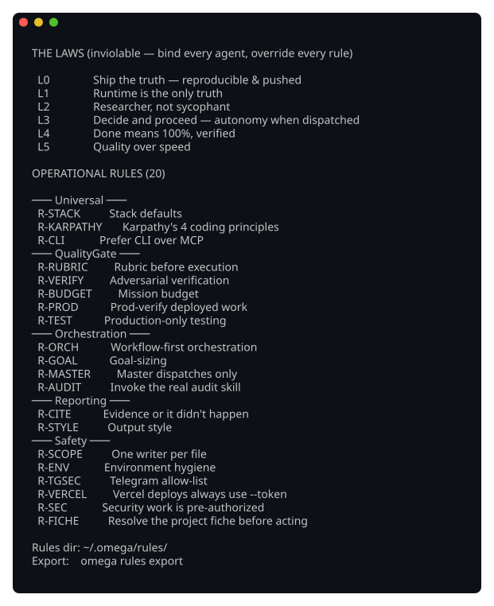

# OmegaOS

A terminal control plane for running a fleet of AI coding agents in parallel, where every agent obeys the same typed rulebook.

[English](README.md) | [Français](README.fr.md) | [Русский](README.ru.md) | [中文](README.zh.md)

[](https://github.com/agentik-os/OmegaOS/actions/workflows/ci.yml)  

OmegaOS is not a library you import. You install it on a Linux box and you get the `omega` command, a TUI for watching and killing sessions, and an orchestration layer that hands work to agents — plus a Telegram bridge if you want to drive it from your phone. The default agent runtime is Claude Code; what's different here is that every agent, however deep in the tree, carries the same non-negotiable rules, injected as plain text into its prompt. That's the doctrine, and it's where to start.

Current version: see [CHANGELOG.md](CHANGELOG.md) (`omega -V` on an installed box). I run it daily; expect rough edges.

## Install

One command on a Linux box (macOS mostly works):

```
npx omega-os
```

It clones the repo and runs the installer behind an interactive Matrix-rain progress screen (type to inject glyphs, `space` to pulse; `npx omega-os --plain` for a plain bar). Prefer to do it by hand:

```
git clone https://github.com/agentik-os/OmegaOS
cd OmegaOS
./install.sh
```

The installer downloads prebuilt `rmux` + `omega` binaries for your platform when a release is published (verified by checksum), and falls back to building from source otherwise — so a fresh clone always reproduces the system, just faster when a binary exists. Force a source build with `OMEGA_FROM_SOURCE=1 ./install.sh`.

## First 5 minutes

The stack installs itself; only the personal pieces are left. **`omega guide`
prints the full step-by-step** (also saved at `~/.omega/GETTING-STARTED.md`,
and shown at the end of the install). In short:

1. **Connect Claude** *(required)* — `claude` → `/login` → follow the URL. Check: `claude auth status`.
2. **Telegram remote** *(recommended)* — token from [@BotFather](https://t.me/BotFather), your id from [@userinfobot](https://t.me/userinfobot), then `OMEGA_TG_TOKEN=<TOKEN> omega telegram setup <ID> --user-id <ID>` (the env form keeps the token out of the process list). For one-topic-per-project: group + Topics on + bot admin → `/setupgroup` → `/sync`.
3. **Service keys** *(optional)* — `~/.omega/provisioning/services.env` (Vercel / GitHub / Convex / Stripe / OpenAI-for-voice) powers auto-provisioning of new apps.
4. **Add a project** — `omega` → **[N] New Project**, Telegram → *Import from GitHub*, or just drop a repo under `~/Station/<Category>/`.
5. **Verify** — `omega doctor`: every line `[+]`.

Here is a real `omega doctor` run:

```
OmegaOS doctor

  [+] binary           omega 0.1.5
  [+] rmux daemon      connected, 6 live session(s)
  [+] rmux socket      /tmp/rmux-1000/default
  [+] doctrine         6 Laws + 26 Rules
  [+] agent CLI        claude available
  [+] state dir        /home/vibe/.omega/state
  [+] telegram service omega-tg-bot active
  [+] hooks            track + verify present, registered in settings.json
  [+] secrets dir      /home/vibe/.omega present
  [+] memory           249088MB available
  [+] usage cache      usage cache 1 min old
  [+] claude oauth     Claude OAuth valid
  [+] telegram poller  1 poller
  [+] provisioning     provisioning: VERCEL_TOKEN, CONVEX_TEAM_TOKEN, STRIPE_SECRET_KEY
```

`[!]` lines are warnings with the repair command inline; `omega doctor --fix` repairs the mechanical ones.

## What you can do

- **Dispatch missions.** `omega dispatch <Project> "<mission>"` hands work to that project's oracle, which plans, spawns workers, and gates the result. `omega orchestrate` runs the full classify → plan → dispatch → monitor → gate pipeline in one command.
- **Run typed plans.** `/omg-planner` decomposes a build into a typed DAG (`.planner/tracker.json`); `omega plan-run` executes it with structural can't-skip enforcement (Gate) and independent verify-command proof (Guardian).
- **Bootstrap whole apps.** `/omg-new-project` provisions Vercel/Convex/GitHub/Clerk/Stripe from your keys, scaffolds the stack, then runs vision → PRD → plan → build.
- **Parallelize safely.** Workers claim their files with real advisory locks (`fs2`), and `omega spawn-worker --worktree` gives each parallel worker its own git worktree with a clean merge at the end. Completion is a `done.json` with a status, not a vibe.
- **Audit everything.** A Quality Arsenal of 23 forensic Gestalt-Popper audits (`codeaudit`, `secaudit`, `perfaudit`, `a11yaudit`, …) auto-selected for what changed, plus `/omg-acceptance` — an autonomous browser-acceptance gate that sweeps every route and fixes what it finds.
- **Convene a council.** `/omg-llm-council` puts one question to four different Claude models in parallel, has them peer-review each other anonymously, and synthesizes a verdict with the dissent intact — no API keys, it runs inside your existing session.
- **Browse agentically.** `/omg-browser-use` drives a cloud browser for tasks scripted Playwright can't express.
- **Do the go-to-market too.** A vendored marketing pack (market research, positioning, content strategy, social, cold email, ad creative, launch strategy) plus the Higgsfield visual-identity pair.
- **Get reports on your phone.** Every mission ends with a branded PDF report in the project's Telegram topic, and a live progress card updates in place while it runs. A deposit bot gives agents a private inbox for files you send from your phone.
- **Operate it.** `omega doctor` (whole-stack health), `patrol` (session watchdog), `usage` (token budget + Telegram alerts), `backup` (irreproducible `~/.omega` state → one tgz), `cleanup` / `kill-all`, `timeline` (replay a mission), `resurrect` (revive a crashed oracle), `provision` (per-client credential groups).
- **Resolve Linear tickets end to end.** `/omg-linear` fixes, captures evidence, audits to 100/100, comments, and moves the ticket to review — never to Done; a human does that. See [Linear integration](#linear-integration).

Three ways in: the `ratatui` TUI (5 tabs: Sessions, Menu, Agentic, Settings, Help), the `omega` CLI (40+ commands), and the Telegram hub. An RPC mode (JSONL over stdin/stdout) drives it from other tools. Underneath, it all runs on [rmux](https://github.com/agentik-os/rmux), a Rust terminal multiplexer — no tmux dependency.

## The doctrine

There's a typed registry of 6 Laws and a set of named operational Rules (26 at the time of writing — `omega rules list` prints the current set). It lives in Rust, at `crates/omega-core/src/rules.rs`, so it's a compiled artifact and not a YAML file someone forgot to update.

**Laws are inviolable.** They bind every agent and they override every rule and every task. There are six:

- **L0 — Ship the truth.** A change isn't done until a clean rebuild reproduces it and it's pushed. Anything less is a draft.
- **L1 — Runtime is the only truth.** Code and comments state intent. Only running it reveals reality. When they disagree, runtime wins.
- **L2 — Researcher, not sycophant.** Challenge a flawed premise with reasoning before you act. No fake confidence. "This should work" without evidence is a lie.
- **L3 — Decide and proceed.** A dispatched agent is autonomous. It never stops to ask "should I continue?" It decides, executes, and reports after.
- **L4 — Done means 100%, verified.** 92% is not done. Enumerate the tasks, finish each, verify each against runtime.
- **L5 — Quality over speed.** No streamlined, lightweight, or quick variant of a real protocol. A 403 or a 401 is an abort, not a pass.

**Rules are operational.** Named (R-SCOPE, R-VERIFY, R-CITE, …) and sorted into Universal, QualityGate, Orchestration, Reporting, and Safety. Each Rule is scoped to the roles it binds: Master, Oracle, Worker. A worker doesn't get burdened with orchestration rules it can't act on, and an oracle doesn't carry the worker's file-locking discipline. Same registry, different slices.

### The funnel

This is the mechanism. One function, `rules::agent_context_block(scope)`, builds the role-scoped slice of Laws and Rules and injects it into the system prompt of every agent the moment it's dispatched.

A worker three levels down the tree carries the same six Laws as the Master at the top. Nobody can spawn a child that quietly drops L5 to go faster, because the child's prompt is assembled from the same registry by the same function.

Because the doctrine is just text, it works the same whether the backend is Claude, GPT, Gemini, or something you add later.

See the whole thing:

```
omega rules list
```



## Architecture

Four levels, top to bottom:

```
┌─────────────────────────────────────────────────────────────────┐
│  Level 1 — Human Interface                                      │
│  TUI (5 tabs) · CLI (40+ cmds) · Telegram hub                   │
│                      ↓ intent                                   │
├─────────────────────────────────────────────────────────────────┤
│  Level 2 — Master (persistent brain — the Atlas topic)          │
│  14 Matrix-named agent templates, classify → route              │
│                      ↓ dispatch                                 │
├─────────────────────────────────────────────────────────────────┤
│  Level 3 — Oracle (1 per project)                               │
│  Classify → Plan → Dispatch workers → Quality gate              │
│                      ↓ decompose                                │
├─────────────────────────────────────────────────────────────────┤
│  Level 4 — Workers (ephemeral, parallel, file-lock scoped)      │
│  Execute → Verify → done.json → Oracle acks → close             │
└─────────────────────────────────────────────────────────────────┘
```

**Level 2 — the Master.** A persistent agent that stays running, auto-restarts if it dies, and resumes its own conversation. It ships 14 agent templates named after Matrix characters (Oracle, Morpheus, Seraph, Keymaker, Smith, Niobe, Architect, Merovingian, Neo, Zion, Link, Construct, Pythia, Council). The Master is a dispatcher. It only classifies and routes work to oracles.

**Level 3 — Oracle.** One per project. It classifies the request, plans, dispatches workers, and runs the quality gate at the end. An oracle orchestrates. It does not edit project code itself, so the grader and the writer are never the same agent.

**Level 4 — Workers.** Ephemeral. They run in parallel, each scoped to its own files by a file-lock claim (advisory locks via `fs2`) — and optionally to its own git worktree. A worker signals completion by writing a `done.json` with status `done_clean`, `pending`, or `failed`; without that status it isn't done.

### How a mission runs

A request enters via the TUI, the CLI, or Telegram. Wherever it starts, it lands on the Master, which reads it, classifies it, and routes it to the oracle that owns the relevant project. The oracle plans the mission, splits it into tasks, and dispatches a worker per task. Workers verify their own results against actual runtime and write their `done.json`; the oracle reads it, runs the gate, and reports up the chain.

A worker doesn't have to chew through its subtasks one at a time. It can run a workflow in-process: spawn parallel sub-agents, check their outputs, and combine them into one answer. Code review uses this, as do research, audits, and design work.

Verification is deliberately adversarial: a worker reporting "done" doesn't end the check; its claim goes to independent agents, and it only survives if a majority (two of three) agree. The Quality Arsenal audits plug in right here, at the gate.

This depends on the doctrine funnel above: every agent, at every level, gets its role-scoped Laws and Rules injected the moment it's dispatched.

This README section is itself an example. A workflow produced it. One agent wrote the draft, independent readers went through it hunting for AI-generated prose, another agent revised against what they flagged, and native speakers handled the translation. So no part of this text came from a single unreviewed pass.

## Stack

It's a Rust workspace with three crates:

- `omega-core` — orchestration, the rules registry, doctor, timeline, cleanup, patrol, file-scope locking.
- `omega-cli` — the `omega` binary, built on `clap`.
- `omega-tui` — the session manager, built on `ratatui`.

Underneath, it runs on [rmux](https://github.com/agentik-os/rmux), a Rust terminal multiplexer: a daemon, a typed SDK, and PTY handling. rmux is a typed Rust library, so OmegaOS calls it directly instead of shelling out to tmux and parsing text. There is no tmux dependency anywhere.

Bun and TypeScript do the PDF report rendering (through Next.js and Playwright) and the Telegram bots. Bash shows up in exactly one place: the install bootstrap.

## Connecting remotely

The rmux daemon owns every session, so your agents keep running after you disconnect. To get back to them, **attach** — reconnect your terminal to a session that's already running:

```
rmux attach              # re-attach to the last session
rmux attach -t claude-1  # attach to a specific one
rmux list-sessions       # see what's live
```

Detach again with `Ctrl-b d` — the session and its agents keep running without you.

`omega` wraps the entrypoints you actually reach for:

```
omega                       # open the TUI session manager (browse / launch / monitor)
omega attach -t claude-1    # drop straight into one session to work in it
omega master                # jump to the Master session
omega list                  # list every live session
```

Use the menu (`omega`) to manage and launch; use a direct attach (`omega attach -t …`, or `rmux attach -t …`) when you want to type heads-down in a single session — the menu's preview *mirrors* the pane, while a direct attach is the lowest-latency path.

Over SSH from a laptop, plain SSH waits a full network round-trip before echoing each keystroke, so on a distant box typing feels laggy and agent output arrives in chunks — no matter how fast the box is, because it's latency, not CPU. `install.sh` installs [`mosh`](https://mosh.org) for this: it echoes your keystrokes locally and ships screen diffs over UDP, so typing is instant and streaming is smooth at any latency. Connect straight into a session with:

```
mosh user@host -- omega attach -t claude-1
```

In a client like **Termius**: set the host IP + port, turn the **mosh** toggle on, and add a startup snippet — `omega` for the menu, or `omega attach -t <session>` to land directly in a session.

(Use rmux's `Alt+Up/Down` for scrollback, not mosh's PageUp.) The installer also wires `/etc/rmux.conf` and a UTF-8 locale system-wide, so every account — root and future users — gets the same hardened session (mouse scroll, drag-select to the local clipboard over SSH, snappy keys, truecolor) with no per-user setup.

## Linear integration

If you track user feedback in [Linear](https://linear.app), OmegaOS resolves the tickets end to end. Two commands.

`/omg-linear-setup` is a one-time wizard, run inside your own app. It installs an in-app feedback widget (it captures a screenshot, the page URL, the clicked element, and the browser console at report time), the Linear labels the pipeline keys off, and the API route that turns a widget report into a Linear issue. It detects your stack, auth provider, and UI library first, so it writes code that fits the project rather than a generic template.

`/omg-linear` does the work. It reads the open tickets, and for each one it fixes the code, captures before/after evidence, then runs the Quality Arsenal audits that fit the change. A ticket only advances if those audits hit 100/100. Then it posts a fix-verification comment on the ticket and moves it to a review state — `In Review` if your team has one, otherwise a neutral `Omega Review` it creates. It never marks a ticket Done; a human does that after checking. The v2 engine runs this through a Workflow: it triages the open tickets, fans the per-ticket fix-and-audit out in parallel, and verifies each resolution adversarially before commenting.

It's trigger-guarded. OmegaOS only touches Linear when you ask for it by name (`/omg-linear`, `fix linear`, a ticket id like `KOM-7`, or a `linear.app` link). The bare word "feedback" never sets it off, and it won't mention Linear unless you do.

```
omega_dir=~/.omega          # the protocol ships to ~/.omega/skills/linear/
/omg-linear-setup           # once per app — installs the widget + labels + route
/omg-linear                 # resolve open tickets: fix -> audit -> comment -> In Review
```

## Limits

I'd rather you know these going in.

- **Linux-first.** Developed on a headless VPS. No Windows. macOS gets real fixes (launchd services, Homebrew path) but is less exercised.
- The TUI assumes a 256-color terminal. On a 16-color terminal it'll be ugly.
- The default agent runtime is Claude Code, so you need the `claude` CLI and an Anthropic account. Other agents (pi, codex, gemini, glm) install via `omega install` and run, but they're less exercised.
- **Single machine.** The rmux daemon is local. There's no multi-host orchestration.
- It's 0.1.x. I use it daily, but you'll find rough edges I haven't hit yet.

## Read GUIDE.md next

**[GUIDE.md](GUIDE.md)** is the operator manual: the vocabulary (mission, oracle, worker, goal, plan, Atlas), the three cockpits, your first missions, the skill catalog, and how work gets verified. Then go deeper:

- [docs/README.md](docs/README.md) — the documentation index.
- [docs/ARCHITECTURE.md](docs/ARCHITECTURE.md) — the full-system reference.
- [docs/MAP.md](docs/MAP.md) — where everything lives on disk.
- [docs/THEMES.md](docs/THEMES.md) — the TUI palette gallery.
- [docs/RESET-RECOVERY.md](docs/RESET-RECOVERY.md) — backup and rebuild a box.
- [CHANGELOG.md](CHANGELOG.md) — what shipped, release by release.

## Credits

OmegaOS builds on a lot of other people's work:

The largest debt is [rmux](https://github.com/agentik-os/rmux), the Rust terminal multiplexer everything here runs on.

The rest of the Rust stack:

- [ratatui](https://github.com/ratatui/ratatui) and [crossterm](https://github.com/crossterm-rs/crossterm) — the TUI.
- [tokio](https://github.com/tokio-rs/tokio) — the async runtime.
- [clap](https://github.com/clap-rs/clap) and `clap_complete` — the CLI and shell completions.
- [serde](https://github.com/serde-rs/serde) with `serde_json`, `serde_yaml`, and `toml` — config and state.
- [anyhow](https://github.com/dtolnay/anyhow) and [thiserror](https://github.com/dtolnay/thiserror) — error handling.
- `chrono` (timestamps), `dirs` (paths), `fs2` (the advisory file locks behind scope claims), `regex`, `tempfile`, `tracing` with `tracing-subscriber` (logging), and `reqwest` (Telegram and PDF HTTP).

[Claude Code](https://www.anthropic.com) by Anthropic is the agent runtime.

## License

Dual licensed under either of [MIT](LICENSE-MIT) or [Apache-2.0](LICENSE-APACHE), at your option. Standard Rust convention. Pick whichever you prefer.
